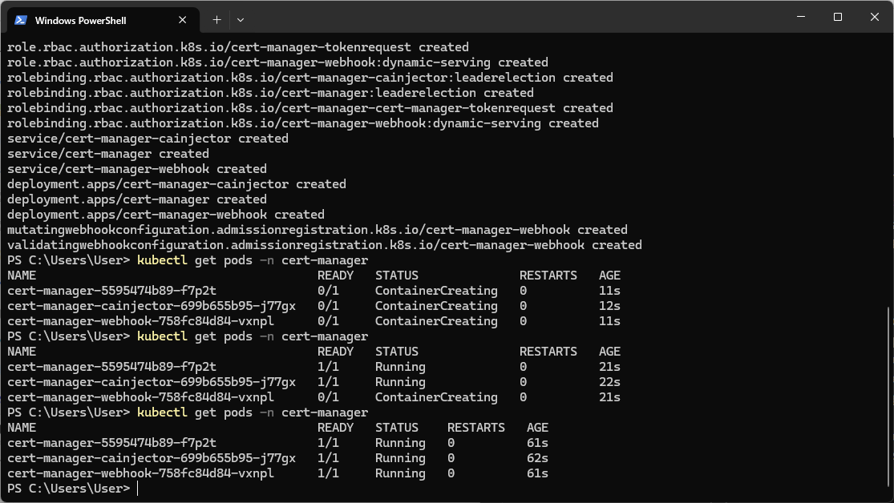
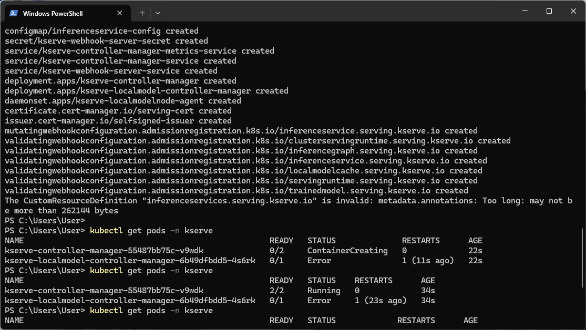
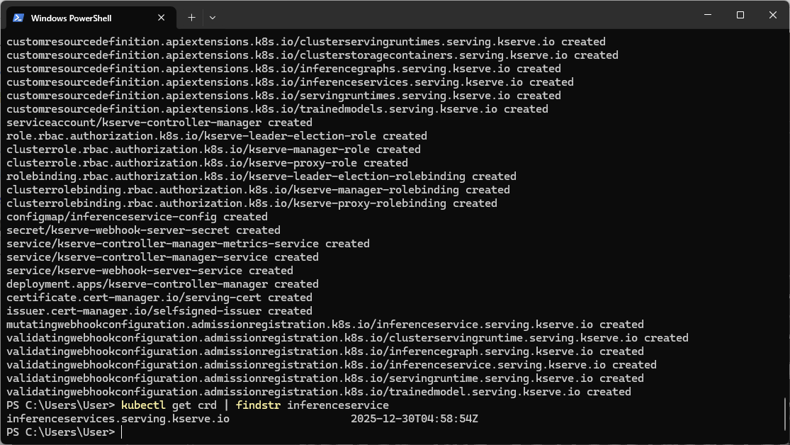
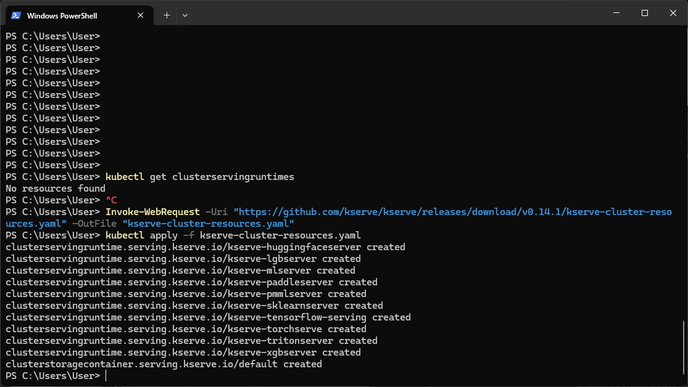
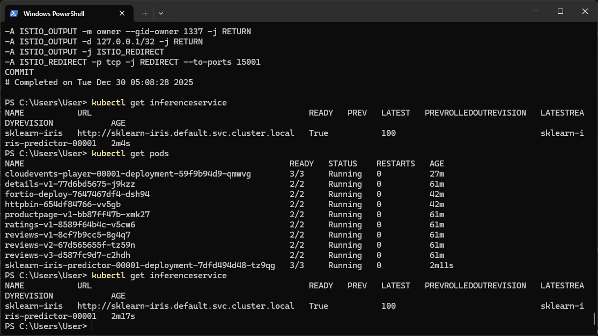
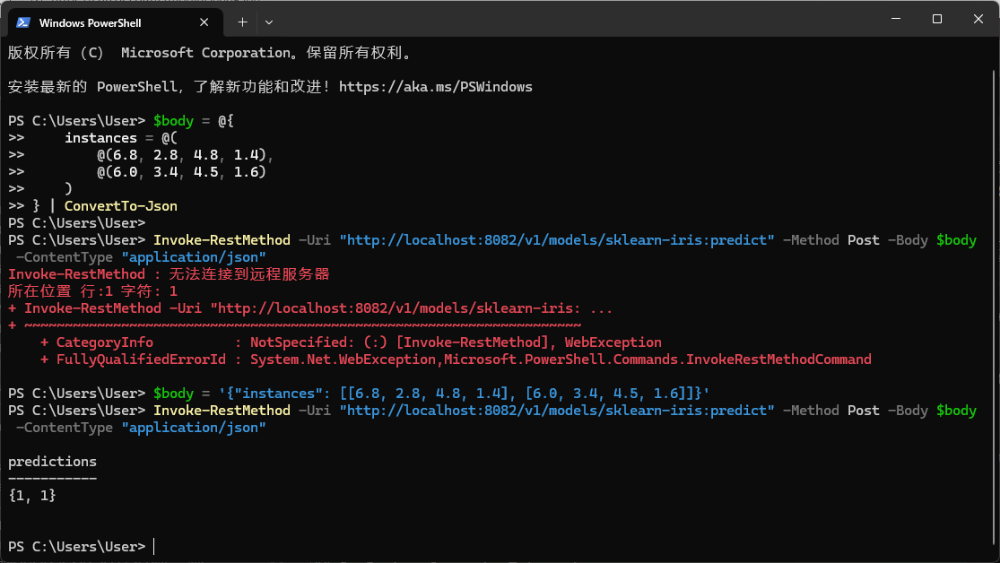

# Laboratory 10: Machine Learning Model Deployment with KServe Platform

## Overview

This laboratory session provides practical implementation experience with the KServe framework, a Kubernetes-native platform designed for machine learning model deployment and inference serving. The session encompasses KServe installation and configuration, predictive model deployment via InferenceService resources, and inference request processing.

## Technical Environment

- **Operating Platform**: Windows 11 utilizing Docker Desktop
- **Kubernetes Platform**: Docker Desktop integrated Kubernetes
- **KServe Distribution**: Version 0.13.0
- **Demonstration Model**: Scikit-learn Iris Classification Model

---

## Segment 1: Certificate Management System Installation

KServe necessitates cert-manager for automated certificate lifecycle management:

```powershell
kubectl apply -f https://github.com/cert-manager/cert-manager/releases/download/v1.16.2/cert-manager.yaml
kubectl get pods -n cert-manager
```



*Visualization 1: Operational certificate management components - cert-manager, cainjector, and webhook all reporting Running status (1/1)*

### Certificate Management Components
- **cert-manager**: Primary component orchestrating certificate issuance and renewal
- **cainjector**: Certificate authority bundle injection into webhooks and API services
- **webhook**: Validation and modification component for certificate resources

---

## Segment 2: KServe Platform Deployment

### Phase 1: Core KServe Component Installation

```powershell
kubectl apply -f https://github.com/kserve/kserve/releases/download/v0.13.0/kserve.yaml
kubectl get pods -n kserve
```



*Visualization 2: KServe controller manager pod operational (2/2)*

### Phase 2: Custom Resource Definition Verification

```powershell
kubectl get crd | findstr inferenceservice
```



*Visualization 3: InferenceService custom resource definition successfully established*

---

## Segment 3: Cluster Serving Runtime Infrastructure Implementation

ClusterServingRuntimes specify model server configurations supporting diverse model format processing:

```powershell
kubectl apply -f https://github.com/kserve/kserve/releases/download/v0.13.0/kserve-cluster-resources.yaml
kubectl get clusterservingruntimes
```



*Visualization 4: ClusterServingRuntimes established for multiple machine learning frameworks*

### Available Runtime Configurations

| Runtime Configuration | Model Framework | Functional Description |
|----------------------|-----------------|------------------------|
| kserve-huggingfaceserver | huggingface | Hugging Face Transformers architecture support |
| kserve-lgbserver | lightgbm | LightGBM gradient boosting framework support |
| kserve-mlserver | sklearn | MLServer implementation for scikit-learn models |
| kserve-paddleserver | paddle | PaddlePaddle deep learning framework support |
| kserve-pmmlserver | pmml | Predictive Model Markup Language format support |
| kserve-sklearnserver | sklearn | Scikit-learn model serving implementation |
| kserve-tensorflow-serving | tensorflow | TensorFlow model serving infrastructure |
| kserve-torchserve | pytorch | PyTorch model serving implementation |
| kserve-tritonserver | tensorrt | NVIDIA Triton Inference Server integration |
| kserve-xgbserver | xgboost | XGBoost gradient boosting framework support |

---

## Segment 4: Scikit-learn Iris Classification Model Deployment

### Phase 1: InferenceService Resource Creation

Deploy pre-trained Scikit-learn Iris classification model:

```powershell
@"
apiVersion: serving.kserve.io/v1beta1
kind: InferenceService
metadata:
  name: sklearn-classification
spec:
  predictor:
    model:
      modelFormat:
        name: sklearn
      storageUri: "gs://kfserving-examples/models/sklearn/1.0/model"
"@ | kubectl apply -f -
```

### Phase 2: Deployment Status Monitoring

```powershell
kubectl get inferenceservice
kubectl get pods
```



*Visualization 5: sklearn-classification InferenceService confirms READY status, predictor pod operational (3/3)*

### Deployment Configuration Details

| Configuration Parameter | Assigned Value |
|-------------------------|----------------|
| **Service Identifier** | sklearn-classification |
| **Service Endpoint** | http://sklearn-classification.default.svc.cluster.local |
| **Operational Status** | Ready |
| **Current Revision** | sklearn-classification-predictor-00001 |

---

## Segment 5: Inference Request Processing

### Phase 1: Predictor Pod Port Forwarding Configuration

```powershell
kubectl port-forward sklearn-classification-predictor-00001-deployment-7dfd494d48-tz9qg 8082:8080
```

### Phase 2: Inference Request Transmission

In separate PowerShell session, transmit inference requests containing Iris specimen measurements:

```powershell
$requestPayload = '{"instances": [[6.8, 2.8, 4.8, 1.4], [6.0, 3.4, 4.5, 1.6]]}'
Invoke-RestMethod -Uri "http://localhost:8082/v1/models/sklearn-classification:predict" -Method Post -Body $requestPayload -ContentType "application/json"
```



*Visualization 6: Successful inference response generation with classification predictions {1, 1}*

### Inference Result Interpretation

**Input Feature Specifications** (Iris specimen morphological measurements):
- Sepal length measurement, Sepal width measurement, Petal length measurement, Petal width measurement

**Specimen Analysis 1**: `[6.8, 2.8, 4.8, 1.4]`
- Classification Result: **1** (Iris-versicolor species)

**Specimen Analysis 2**: `[6.0, 3.4, 4.5, 1.6]`
- Classification Result: **1** (Iris-versicolor species)

### Iris Species Classification Taxonomy

| Numerical Classification | Species Designation | Botanical Characteristics |
|--------------------------|---------------------|---------------------------|
| 0 | Iris-setosa | Compact floral morphology with abbreviated petal structures |
| 1 | Iris-versicolor | Intermediate floral dimensions with moderate petal development |
| 2 | Iris-virginica | Substantial floral morphology with elongated petal formations |

---

## Implementation Summary

| Implementation Task | Completion Status | Functional Description |
|--------------------|-------------------|------------------------|
|  Certificate Management Installation | Successfully completed | Certificate orchestration infrastructure for KServe platform |
|  KServe Platform Deployment | Successfully completed | Machine learning model serving platform implementation |
|  Cluster Serving Runtime Implementation | Successfully completed | Framework support for sklearn, tensorflow, pytorch, and additional frameworks |
|  InferenceService Resource Deployment | Successfully completed | sklearn-classification model deployment with operational readiness |
|  Inference Request Processing | Successfully completed | Predictive classifications: {1, 1} for test specimen measurements |

## Demonstrated Architectural Concepts

### KServe Platform Architecture
- **InferenceService Resource**: Custom Kubernetes resource for machine learning model deployment
- **Predictor Component**: Request processing module handling inference operations
- **ClusterServingRuntime**: Model server configuration definitions supporting diverse frameworks

### Model Serving Capabilities
- **Adaptive Scaling**: Pod resource allocation adjusts according to inference demand patterns
- **Progressive Deployment**: Controlled model version transition through incremental exposure
- **Model Performance Tracking**: Performance metrics collection and model drift detection
- **Framework Diversity Support**: Scikit-learn, TensorFlow, PyTorch, and additional framework compatibility

## Implementation Conclusions

This laboratory session demonstrated comprehensive machine learning model deployment workflows utilizing the KServe platform within Kubernetes environments:

1. **Infrastructure Establishment**: Certificate management system and KServe component deployment
2. **Runtime Environment Configuration**: ClusterServingRuntimes implementation for diverse machine learning frameworks
3. **Model Deployment Execution**: Scikit-learn Iris classification model deployment as InferenceService resource
4. **Inference Validation**: Successful predictive request transmission and classification result reception

The KServe platform establishes a standardized, scalable infrastructure for production machine learning model serving, supporting multiple frameworks and enabling sophisticated deployment methodologies.

## Reference Documentation

- [KServe Implementation Quickstart Documentation](https://kserve.github.io/website/docs/getting-started/quickstart-guide)
- [Initial InferenceService Implementation Guidelines](https://kserve.github.io/website/docs/getting-started/predictive-first-isvc)
- [KServe Source Repository](https://github.com/kserve/kserve)