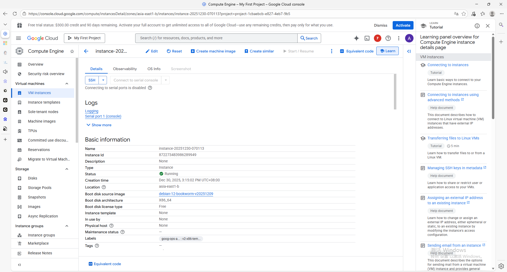
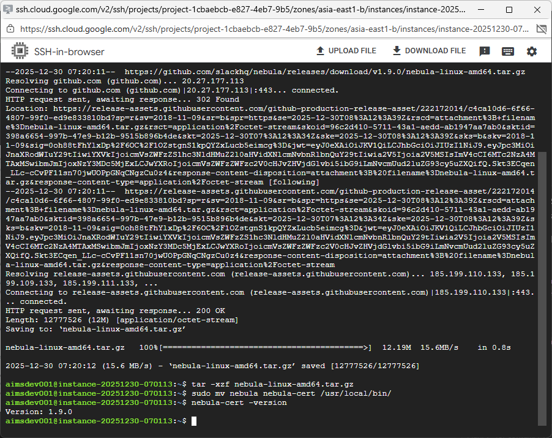
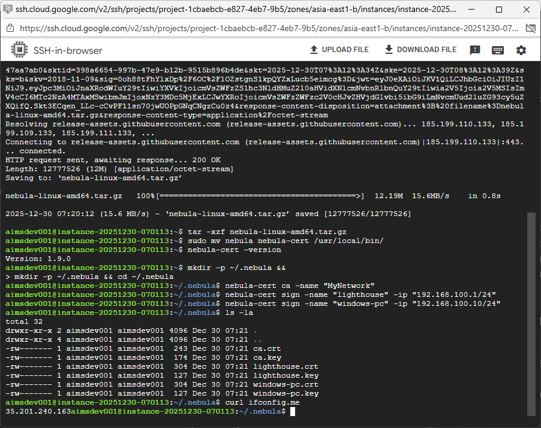
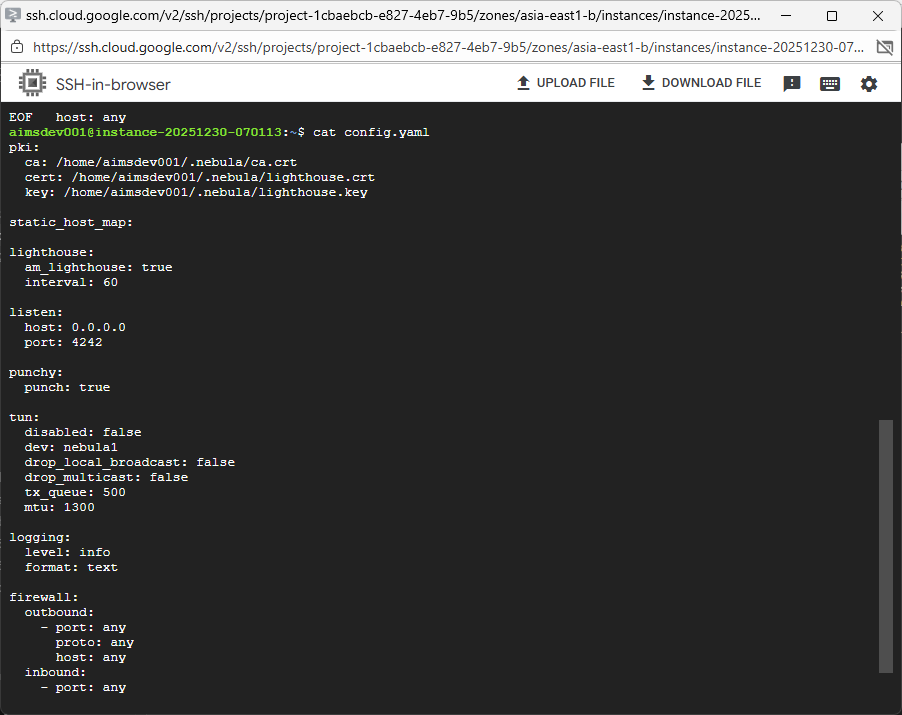
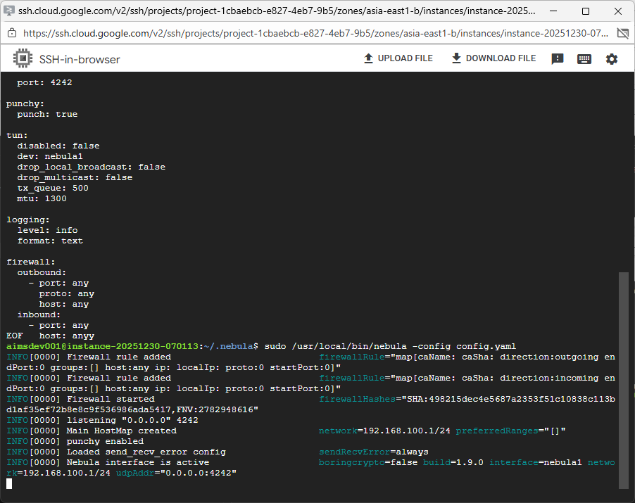
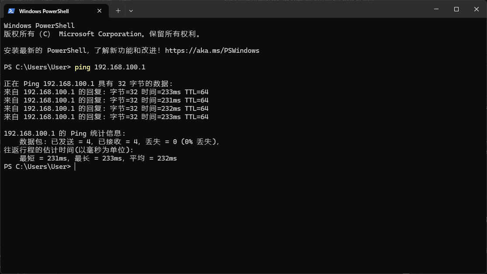

# Lab 2: Configuring Nebula VPN for NAT Penetration

## Project Introduction

This practical exercise involves the implementation of Nebula, an open-source software-defined networking solution created by Slack Technologies, to create encrypted tunnels between devices situated behind network address translation (NAT) barriers. The configuration employs a cloud-hosted coordination server to facilitate peer-to-peer connectivity.

## Technical Context

- **Coordination Server**: Virtual machine on Google Cloud Platform running Debian 12
  - Geographic location: asia-east1-b
  - Compute specifications: e2-micro configuration
  - External network address: 35.201.240.163
- **Endpoint Device**: Windows 11 desktop computer operating behind NAT
- **Software Version**: Nebula 1.9.0 release
- **Overlay Network Range**: 192.168.100.0/24 subnet

---

## Section 1: Provisioning Cloud Infrastructure

### Action 1: Deploy Virtual Machine Instance

Established a Compute Engine virtual machine on Google Cloud with these parameters:

| Configuration Parameter | Assigned Value |
|-------------------------|----------------|
| Instance identifier | instance-20251230-070113 |
| Geographic zone | asia-east1-b |
| Compute profile | e2-micro (dual virtual CPUs, 1GB RAM) |
| Operating system | Debian GNU/Linux 12 (bookworm) |
| Operational state | Active |



*Visual 1: Google Cloud virtual machine operational status display*

---

## Section 2: Software Deployment on Coordination Server

### Action 1: Acquire and Configure Nebula

Connected via SSH to the cloud instance and performed software installation:

```bash
cd ~
wget https://github.com/slackhq/nebula/releases/download/v1.9.0/nebula-linux-amd64.tar.gz
tar -xzf nebula-linux-amd64.tar.gz
sudo mv nebula nebula-cert /usr/local/bin/
nebula-cert -version
```



*Visual 2: Nebula version 1.9.0 verified as operational on coordination server*

---

## Section 3: Cryptographic Credential Generation

### Action 1: Produce Certificate Authority and Node Credentials

```bash
mkdir -p ~/.nebula && cd ~/.nebula

# Create Certificate Authority
nebula-cert ca -name "NetworkInfrastructure"

# Generate coordination server certificate
nebula-cert sign -name "coordination-server" -ip "192.168.100.1/24"

# Produce Windows endpoint certificate
nebula-cert sign -name "windows-endpoint" -ip "192.168.100.10/24"
```

### Action 2: Validate Created Credentials

```bash
ls -la
```


*Visual 3: Successful creation of CA, coordination server, and endpoint certificates*

### Generated Cryptographic Materials

| File Name | Purpose |
|-----------|---------|
| ca.crt | Public certificate for Certificate Authority |
| ca.key | Private cryptographic key for Certificate Authority |
| coordination-server.crt | Certificate for coordination server node |
| coordination-server.key | Private key for coordination server |
| windows-endpoint.crt | Certificate for Windows client device |
| windows-endpoint.key | Private key for Windows client |

### Action 3: Determine External Network Address

```bash
curl ifconfig.me
```

Result obtained: **35.201.240.163**



*Visual 4: External IP address of the coordination server*

---

## Section 4: Coordination Server Configuration

### Action 1: Create Server Configuration File

```bash
cat > server-config.yaml << 'EOF'
pki:
  ca: /home/aimsdev001/.nebula/ca.crt
  cert: /home/aimsdev001/.nebula/coordination-server.crt
  key: /home/aimsdev001/.nebula/coordination-server.key

static_host_map:

lighthouse:
  am_lighthouse: true
  interval: 60

listen:
  host: 0.0.0.0
  port: 4242

punchy:
  punch: true

tun:
  disabled: false
  dev: nebula1
  drop_local_broadcast: false
  drop_multicast: false
  tx_queue: 500
  mtu: 1300

logging:
  level: info
  format: text

firewall:
  outbound:
    - port: any
      proto: any
      host: any
  inbound:
    - port: any
      proto: any
      host: any
EOF
```



*Visual 5: Coordination server configuration with lighthouse functionality enabled*

### Critical Configuration Elements

- **am_lighthouse: true** - Designates this node as coordination server
- **listen port: 4242** - UDP communication port for Nebula protocol
- **punchy: true** - Activates NAT penetration capability

---

## Section 5: Activating Coordination Service

### Action 1: Initiate Nebula on Coordination Server

```bash
sudo /usr/local/bin/nebula -config server-config.yaml
```



*Visual 6: Coordination service successfully activated with overlay network 192.168.100.1/24*

### Service Operational Status

| Component | Current State |
|-----------|---------------|
| Network filtering | Operational |
| Virtual interface | nebula1 active |
| Overlay network | 192.168.100.1/24 |
| Listening state | 0.0.0.0:4242 |
| NAT penetration | Enabled |

---

## Section 6: Windows Endpoint Configuration

### Action 1: Transfer Cryptographic Materials

Transferred these files from coordination server to `C:\nebula-vpn` directory:
- ca.crt
- windows-endpoint.crt
- windows-endpoint.key

### Action 2: Obtain Windows Nebula Binary

```powershell
cd C:\nebula-vpn
Invoke-WebRequest -Uri "https://github.com/slackhq/nebula/releases/download/v1.9.0/nebula-windows-amd64.zip" -OutFile "nebula-windows.zip"
Expand-Archive -Path "nebula-windows.zip" -DestinationPath "."
```

### Action 3: Create Endpoint Configuration File

```yaml
pki:
  ca: C:\nebula-vpn\ca.crt
  cert: C:\nebula-vpn\windows-endpoint.crt
  key: C:\nebula-vpn\windows-endpoint.key

static_host_map:
  "192.168.100.1": ["35.201.240.163:4242"]

lighthouse:
  am_lighthouse: false
  interval: 60
  hosts:
    - "192.168.100.1"

listen:
  host: 0.0.0.0
  port: 4242

punchy:
  punch: true

tun:
  disabled: false
  dev: nebula1
  drop_local_broadcast: false
  drop_multicast: false
  tx_queue: 500
  mtu: 1300

logging:
  level: info
  format: text

firewall:
  outbound:
    - port: any
      proto: any
      host: any
  inbound:
    - port: any
      proto: any
      host: any
```

### Essential Client Settings

- **am_lighthouse: false** - Identifies this as endpoint node
- **static_host_map** - Associates overlay IP with external endpoint
- **hosts** - Specifies coordination server for network discovery

---

## Section 7: Establishing Secure Tunnel

### Action 1: Activate Windows Client

Execute with administrative privileges:

```powershell
cd C:\nebula-vpn
.\nebula.exe -config client-config.yaml
```


*Visual 7: Windows endpoint successfully connected with cryptographic handshake completed*

### Connection Establishment Log

```
Nebula interface is active
network=192.168.100.10/24
Handshake message sent
Handshake message received certName=coordination-server
vpnIp=192.168.100.1
```

---

## Section 8: Network Connectivity Validation

### Network Reachability Test

```powershell
ping 192.168.100.1
```



*Visual 8: Successful ICMP echo requests to coordination server with complete packet delivery*

### Performance Measurements

| Measurement Parameter | Observed Value |
|-----------------------|----------------|
| Transmitted packets | 4 |
| Received packets | 4 |
| Packet loss percentage | 0% |
| Minimum round-trip time | 231ms |
| Maximum round-trip time | 233ms |
| Average round-trip time | 232ms |

---

## Network Architecture Visualization

```
                    Global Internet
                         |
              +----------+----------+
              |                     |
      +-------+-------+     +-------+-------+
      |  Coordination  |     |  Windows     |
      |     Server     |     |   Endpoint   |
      | (Google Cloud) |     | (NAT Behind) |
      +----------------+     +---------------+
      | Public Address:|     | Private Addr:|
      | 35.201.240.163 |     | (Dynamic)    |
      +----------------+     +---------------+
      | Overlay IP:    |     | Overlay IP:  |
      | 192.168.100.1  |     |192.168.100.10|
      +----------------+     +---------------+
              |                     |
              +----------+----------+
                         |
              Encrypted Overlay Tunnel
                (192.168.100.0/24)
```

---

## Implementation Summary

| Implementation Task | Completion Status |
|---------------------|-------------------|
| ☑ Provision cloud virtual machine | Successfully completed |
| ☑ Deploy Nebula on coordination server | Version 1.9.0 operational |
| ☑ Generate CA credentials | NetworkInfrastructure created |
| ☑ Create node certificates | coordination-server, windows-endpoint |
| ☑ Configure coordination server | am_lighthouse: true enabled |
| ☑ Configure Windows endpoint | am_lighthouse: false configured |
| ☑ Configure network access | UDP port 4242 accessible |
| ☑ Establish encrypted tunnel | Cryptographic handshake successful |
| ☑ Validate connectivity | Zero packet loss confirmed |

## Technical Concepts Illustrated

### Nebula System Architecture
- **Coordination Server**: Central discovery mechanism with public network presence
- **Network Nodes**: Endpoint devices potentially behind NAT barriers
- **Cryptographic Credentials**: Public Key Infrastructure authentication framework

### NAT Barrier Traversal
- **Punchy Mechanism**: Facilitates UDP hole punching for NAT traversal
- **Static Address Mapping**: Correlates overlay addresses with external endpoints
- **Secure Handshake**: Cryptographic key exchange between participating nodes

### Security Implementation
- **Certificate-Based Authentication**: Mandatory valid CA-signed credentials for all nodes
- **Encrypted Communication**: All traffic protected with contemporary cryptographic protocols
- **Granular Access Control**: Configurable traffic filtering policies

## Final Observations

This laboratory exercise effectively demonstrated the configuration of a Nebula overlay network that enables secure communication between a Windows device operating behind NAT and a cloud-based coordination server. Principal accomplishments include:

1. Provisioned an economical virtual machine instance on Google Cloud Platform
2. Generated and distributed necessary cryptographic materials for authentication
3. Configured both coordination server and client endpoints with appropriate parameters
4. Established a functional encrypted tunnel with NAT traversal capability
5. Verified operational connectivity with network diagnostic tools

Nebula presents a sophisticated approach to interconnecting devices across disparate network environments, eliminating the need for complex port forwarding configurations or conventional VPN gateway infrastructure.

## Project Contributor

- **Primary Implementer**: Han Jiayi
- **Implementation Date**: December 2024
- **Academic Context**: Networking and Systems Administration Laboratory

## Reference Materials

- [Nebula Source Code Repository](https://github.com/slackhq/nebula)
- [Nebula Technical Documentation](https://nebula.defined.net/docs/)
- [Google Cloud Platform Free Tier Specifications](https://cloud.google.com/free/docs/free-cloud-features#compute)
- [Network Address Translation Technical Overview](https://tools.ietf.org/html/rfc3022)
