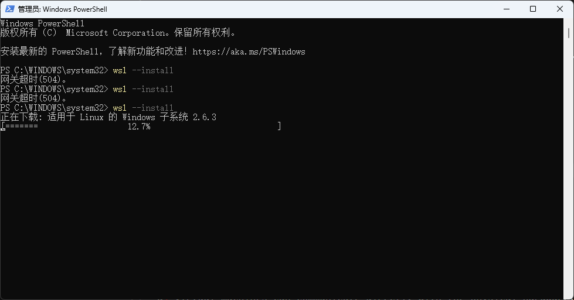
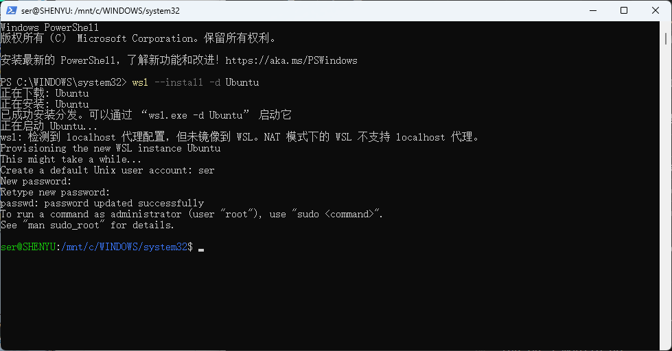
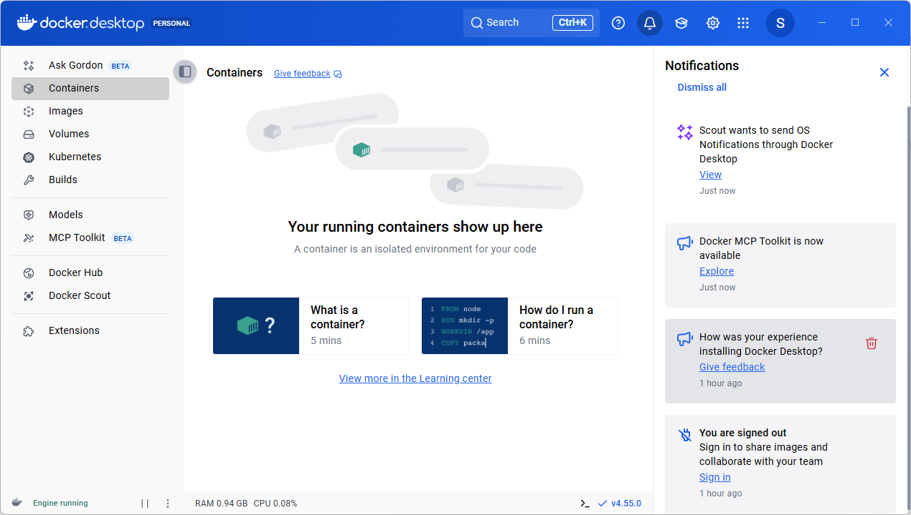
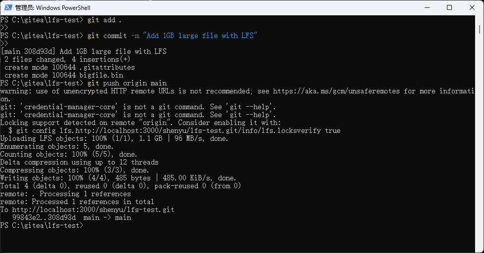
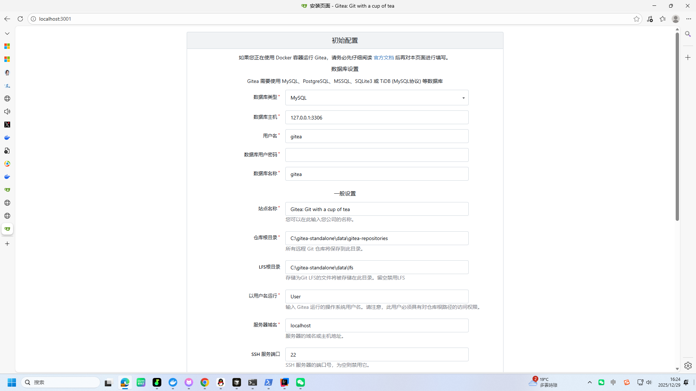

# Lab 4 Report: Docker Desktop and Gitea Setup

## 1. Purpose

- Understand the procedure for installing Docker Desktop on Windows operating systems
- Gain practical experience in deploying Gitea, a self-hosted Git service, using Docker containers
- Validate Gitea's capability to handle Git LFS (Large File Storage)
- Explore alternative Gitea installation methods without Docker dependency

## 2. System Configuration

| Component | Specification |
|-----------|---------------|
| OS Platform | Windows 10/11 |
| WSL Version | 2.6.3 |
| Docker Desktop Release | 4.55.0 |
| Gitea Version | 1.25.3 (Docker deployment) / 1.22.6 (Standalone) |
| Git Client | 2.51.0 |

## 3. Implementation Steps

### 3.1 Setting Up WSL

Execute the following command in an elevated PowerShell session:

```powershell
wsl --install
```



Configure Ubuntu distribution after initial installation:

```powershell
wsl --install -d Ubuntu
```



### 3.2 Docker Desktop Installation

Acquire the Docker Desktop Windows installer (AMD64 architecture) from the official source and execute installation.

Select these options during setup:
- ✅ Utilize WSL 2 as backend (recommended over Hyper-V)
- ✅ Enable Windows Containers compatibility
- ✅ Create desktop shortcut


Reboot the system post-installation and launch Docker Desktop. Verify operational status:



The "Engine running" status indicator confirms successful Docker daemon initialization.

### 3.3 Docker-Based Gitea Deployment

#### 3.3.1 Docker Compose Configuration

Establish `docker-compose.yml` within `C:\gitea` directory:

```yaml
version: "3"

services:
  gitea-server:
    image: gitea/gitea:latest
    container_name: gitea-instance
    environment:
      - USER_UID=1000
      - USER_GID=1000
    restart: unless-stopped
    volumes:
      - ./gitea-data:/data
    ports:
      - "3000:3000"
      - "222:22"
```

#### 3.3.2 Container Initialization

```powershell
cd C:\gitea
docker-compose up -d
```

#### 3.3.3 Gitea Initial Setup

Navigate to http://localhost:3000 for first-time configuration:


Configuration parameters:
- **Database Selection**: SQLite3
- **LFS Storage Location**: /data/git/lfs (demonstrates LFS integration)
- **HTTP Service Port**: 3000

### 3.4 Task a: LFS Functionality Verification

Generate test repository `lfs-verification` within Gitea:


Access Repository Settings → LFS section to confirm functionality activation:


**Verification outcome**: Gitea fully supports Git LFS with dedicated management interface.

### 3.5 Task b: Large File Repository Creation

#### 3.5.1 Test File Generation

```powershell
fsutil file createnew C:\gitea\large-test-file.bin 1073741824
```

#### 3.5.2 LFS Configuration and Upload

```powershell
# Initialize Git LFS
git lfs install

# Retrieve repository
cd C:\gitea
git clone http://localhost:3000/hanjiayi/lfs-verification.git
cd lfs-verification

# Set LFS tracking patterns
git lfs track "*.bin"

# Transfer and commit large file
copy ..\large-test-file.bin .
git add .
git commit -m "Include 1GB file via LFS"
git push origin main
```



Upload metrics display:
- `Uploading LFS objects: 100% (1/1), 1.1 GB | 96 MB/s, done.`
- Successful transmission to Gitea repository

### 3.6 Task c: Academic Repository Establishment

Created `k8s-coursework` repository for laboratory assignment storage.

### 3.7 Non-Docker Gitea Installation

#### 3.7.1 Binary Acquisition

Download Windows binary from official distribution:
- Filename: `gitea-1.22.6-windows-4.0-amd64.exe`
- File size: ~217 MB

#### 3.7.2 Application Execution

```powershell
# Create installation directory
mkdir C:\gitea-native

# Transfer and rename executable
copy "$env:USERPROFILE\Downloads\gitea-1.22.6-windows-4.0-amd64.exe" C:\gitea-native\gitea.exe

# Launch service (port 3001 to prevent conflict)
cd C:\gitea-native
.\gitea.exe web --port 3001
```

#### 3.7.3 Configuration Access

Navigate to http://localhost:3001 for setup:



Configuration elements:
- **Repository Storage**: C:\gitea-native\data\gitea-repositories
- **LFS Storage**: C:\gitea-native\data\lfs
- LFS capability confirmed operational

## 4. Implementation Outcomes

| Objective | Completion Status | Details |
|-----------|------------------|---------|
| WSL Setup | Achieved | Version 2.6.3 operational |
| Docker Desktop Installation | Achieved | Version 4.55.0 functional |
| Docker-Gitea Deployment | Achieved | Service active on port 3000 |
| LFS Verification |  Achieved | Full LFS functionality confirmed |
| Large File Upload |  Achieved | 1.1 GB file successfully transmitted |
| Course Repository Creation | Achieved | k8s-coursework repository established |
| Standalone Gitea Installation | Achieved | Service active on port 3001 |

## 5. Summary

This laboratory exercise accomplished the following educational goals:

1. **WSL Implementation**: Acquired practical knowledge of Linux subsystem integration on Windows platforms.

2. **Docker Desktop Proficiency**: Developed competency in container platform installation and fundamental operations.

3. **Dual Deployment Strategies**:
   - Containerized approach via Docker Compose for rapid, isolated deployment
   - Traditional binary execution method for direct system integration

4. **LFS Validation**: Confirmed Gitea's large file handling capabilities through practical testing.

5. **Comparative Analysis**:
   - Docker methodology offers environmental isolation and simplified management
   - Standalone installation provides direct system integration for straightforward scenarios

The exercise enhanced comprehension of containerization technologies and self-hosted Git repository management systems.
