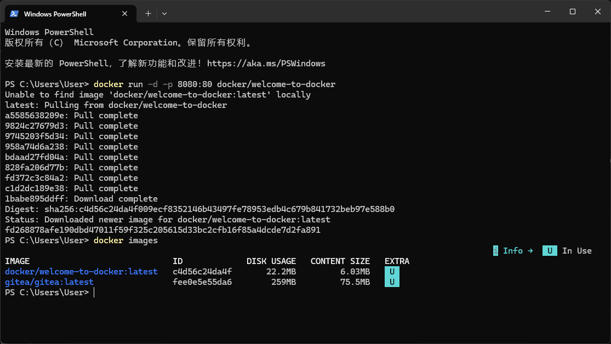
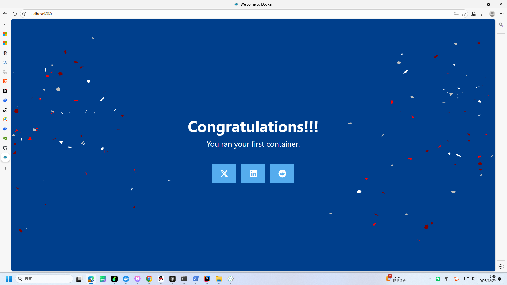
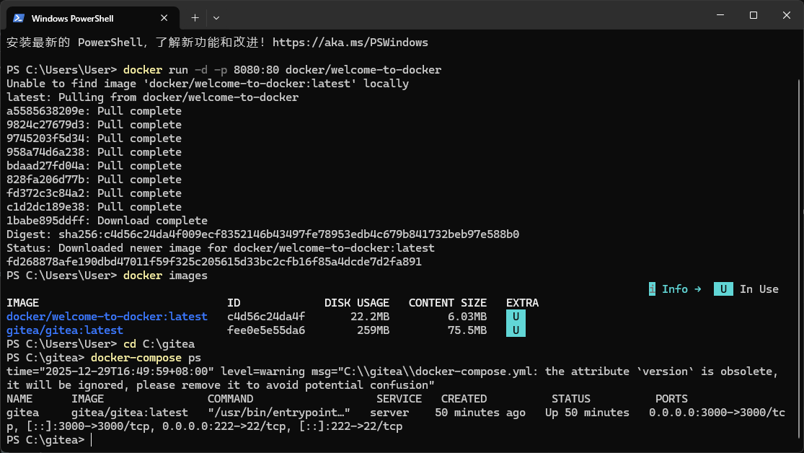
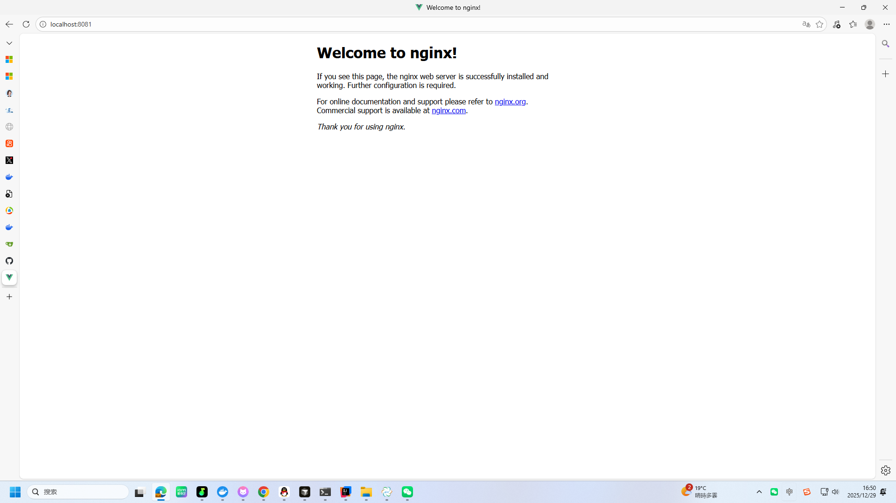
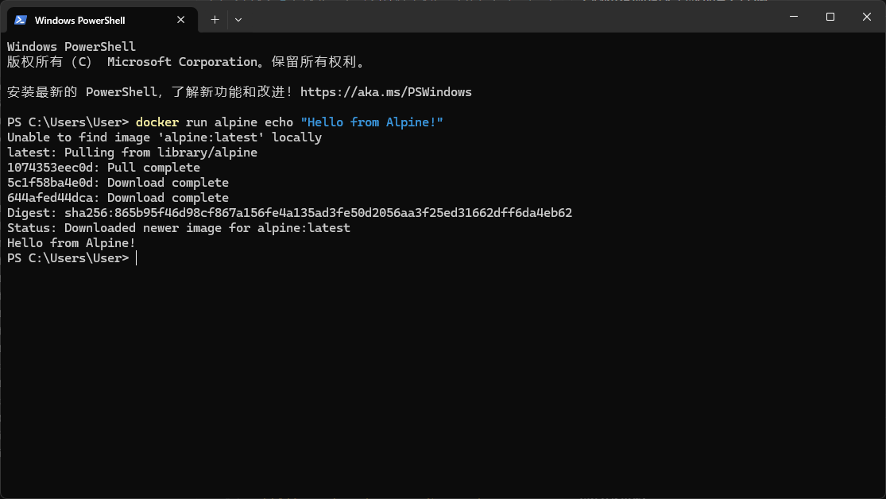
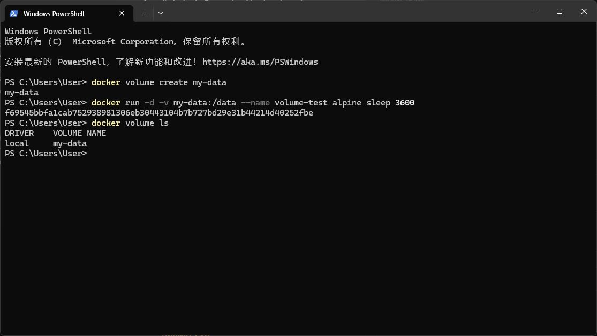
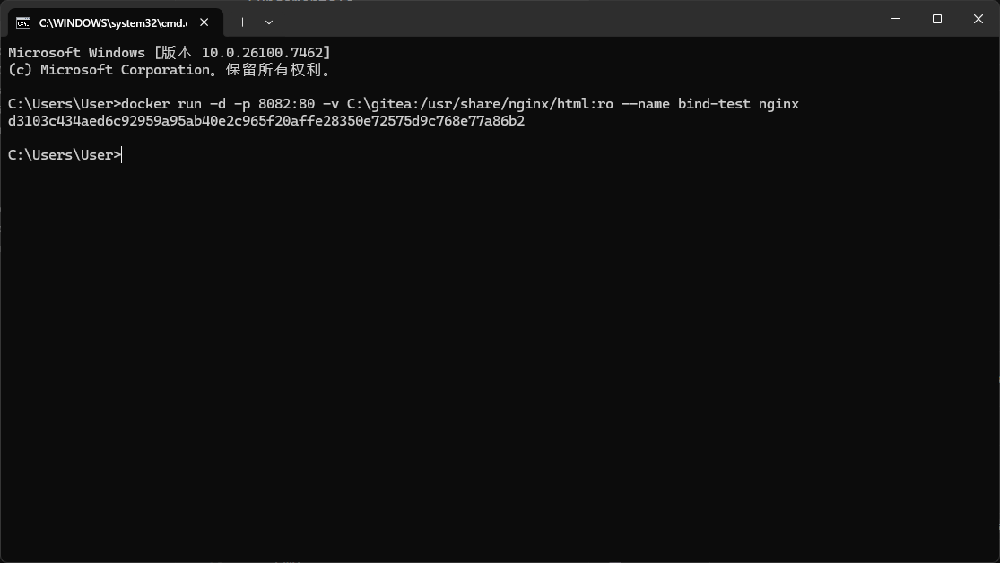
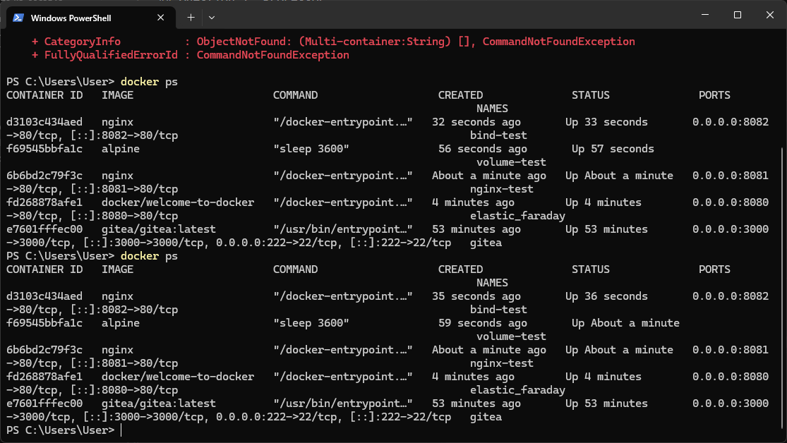

# Lab 5 Report: Container Technology Fundamentals and Management

## 1. Objectives

This practical session focuses on the foundational principles of containerization and Docker:
- Distinguishing between container images and runtime instances
- Utilizing Docker Compose for orchestrating services
- Managing network connectivity and service exposure
- Customizing container runtime configurations
- Implementing data persistence mechanisms
- Facilitating host-container file interaction
- Operating applications composed of multiple containers

## 2. System Environment

| Component | Specification |
|-----------|---------------|
| OS Platform | Windows 10/11 |
| Docker Desktop Release | 4.55.0 |
| WSL Version | 2.6.3 |

## 3. Containerization Concepts and Practical Exercises

### 3.1 Understanding Containers

A **container** is an encapsulated, executable software package comprising:
- Application code and its dependencies
- System libraries and runtime environment
- Configuration files and settings

**Core Attributes:**
- **Isolation**: Processes run independently with controlled resource access
- **Consistency**: Uniform operation across diverse computing environments
- **Resource Efficiency**: Shares the host operating system kernel

**Practical Implementation:**

Initiating the Docker introductory container:
```bash
docker run -d -p 8080:80 docker/welcome-to-docker
```


This command retrieves the specified image and launches a container instance, establishing a network bridge between host port 8080 and container port 80.

**Verification - Welcome Interface:**



The web browser displays a confirmation message, validating successful container execution accessible via `localhost:8080`.

### 3.2 Understanding Container Images

A Docker **image** serves as a blueprint containing:
- Application binaries and supporting libraries
- Environment configurations and variables
- Filesystem structure and metadata

**Fundamental Principles:**
- Images are constructed through **layered architecture**
- Each layer encapsulates specific filesystem modifications
- The layering system enables efficient caching and distribution

**Inspecting Available Images:**

```bash
docker images
```


The system currently hosts:
| Repository | File Size | Purpose |
|------------|-----------|---------|
| docker/welcome-to-docker:latest | 22.2MB | Introductory demonstration |
| gitea/gitea:latest | 259MB | Self-hosted Git service |

### 3.3 Understanding Docker Compose

**Docker Compose** facilitates the definition and operation of multi-service applications through declarative YAML configuration.

**Operational Advantages:**
- Centralized service definition within a single configuration file
- Unified control interface for service lifecycle management
- Simplified inter-service networking configuration
- Version control compatibility for infrastructure-as-code

**Monitoring Compose Service Status:**

```bash
cd C:\gitea
docker-compose ps
```


The Gitea deployment from the previous session operates via Compose:
- **Service Identifier**: gitea
- **Source Image**: gitea/gitea:latest
- **Network Ports**: 3000→3000, 222→22

### 3.4 Network Port Configuration

**Port configuration** enables external system access to services operating within container boundaries. The standard syntax is:

```bash
docker run -p HOST_PORT:CONTAINER_PORT image_name
```

**Demonstration - Deploying Nginx Service:**

```bash
docker run -d -p 8081:80 --name nginx-test nginx
```


Navigating to `localhost:8081` presents the Nginx welcome page, confirming:
- Successful mapping of container port 80 to host port 8081
- Functional external access to the containerized service

**Active Port Mappings:**

| Service | Host Interface | Container Interface |
|---------|----------------|---------------------|
| welcome-to-docker | 8080 | 80 |
| nginx-test | 8081 | 80 |
| bind-test | 8082 | 80 |
| gitea | 3000 | 3000 |

### 3.5 Runtime Configuration Customization

Container instances inherit default behaviors from their source images but support **runtime modification**.

**Example - Command Execution Override:**

```bash
docker run alpine echo "Custom command execution from Alpine!"
```


**Execution Result:**
```
Custom command execution from Alpine!
```

The container executed the specified `echo` instruction instead of launching the default shell, then terminated.

**Common Customization Parameters:**
- `--entrypoint`: Alter the default executable
- Command arguments: Supplement or replace default instructions
- `-e`: Configure environment variables
- `-w`: Define working directory location

### 3.6 Persistent Data Storage Implementation

Container filesystems are inherently **temporary**—data dissipates upon container removal. **Storage volumes** provide enduring data preservation.

**Volume Classification:**

| Category | Description |
|----------|-------------|
| **Named Volumes** | Docker-managed storage with explicit identifiers |
| **Anonymous Volumes** | Automatically generated without specific naming |

**Volume Creation and Utilization:**

```bash
# Generate a named storage volume
docker volume create application-data

# Deploy container with volume attachment
docker run -d -v application-data:/app --name storage-demo alpine sleep 3600

# Display available volumes
docker volume ls
```


**System Output:**
```
DRIVER    VOLUME NAME
local     application-data
```

The `application-data` volume persists independently of container lifecycle.

### 3.7 Host-Container File Synchronization

**Bind mounts** establish direct filesystem linkages between host directories and container paths, enabling:
- Real-time file synchronization
- Development workflow optimization
- Dynamic configuration management

**Implementation Syntax:**
```bash
docker run -v /host_directory_path:/container_directory_path image_name
```

**Practical Application - Nginx Content Hosting:**

```bash
docker run -d -p 8082:80 -v C:\gitea:/usr/share/nginx/html:ro --name bind-test nginx
```


**Configuration Details:**
- `-v C:\gitea:/usr/share/nginx/html:ro`: Links local directory to web server document root
- `:ro`: Restricts container to read-only access
- Host port 8082 forwards to container port 80

### 3.8 Multi-Service Application Orchestration

Production applications frequently comprise interconnected containers:
- Web application servers
- Database management systems
- Caching mechanisms
- Message processing queues

**Active Container Monitoring:**

```bash
docker ps
```


**Operational Services:**

| Container Name | Source Image | Network Ports | Operational Status |
|----------------|--------------|---------------|-------------------|
| bind-test | nginx | 8082:80 | Active |
| storage-demo | alpine | - | Active |
| nginx-test | nginx | 8081:80 | Active |
| elastic_faraday | docker/welcome-to-docker | 8080:80 | Active |
| gitea | gitea/gitea:latest | 3000:3000, 222:22 | Active |

This configuration represents a multi-service environment incorporating:
- Multiple web service instances (Nginx deployments)
- Application platforms (Gitea service)
- Test and utility containers (Alpine instances)

## 4. Essential Docker Command Reference

| Command | Purpose |
|---------|---------|
| `docker run` | Instantiate and activate a container |
| `docker ps` | Enumerate active container instances |
| `docker images` | List locally available images |
| `docker volume create` | Generate a named storage volume |
| `docker volume ls` | Display existing volumes |
| `docker-compose up` | Launch Compose-defined services |
| `docker-compose ps` | Inspect Compose service status |

## 5. Conceptual Knowledge Summary

| Concept | Description |
|---------|-------------|
| **Container** | Isolated runtime environment for application execution |
| **Image** | Immutable template for container instantiation |
| **Docker Compose** | Orchestration tool for multi-container applications |
| **Port Configuration** | Network exposure mechanism for container services |
| **Volumes** | Docker-managed persistent storage solution |
| **Bind Mounts** | Direct host-container filesystem linkage |
| **Runtime Customization** | Dynamic modification of container execution parameters |

## 6. Learning Outcomes

This laboratory session provided practical experience with core containerization concepts:

1. **Container-Image Relationship**: Comprehended the distinction between immutable images and runtime container instances.

2. **Docker Compose Application**: Applied YAML-based configuration for service orchestration and management.

3. **Network Service Exposure**: Implemented port forwarding to enable external service accessibility.

4. **Runtime Adaptation**: Explored methods for customizing container behavior during execution.

5. **Data Management Strategies**: Employed both volumes and bind mounts for data persistence and host-container interaction.

6. **Multi-Service Coordination**: Operated and maintained a complex environment with interdependent containerized services.

These competencies establish the groundwork for advanced container orchestration platforms such as Kubernetes in subsequent coursework.