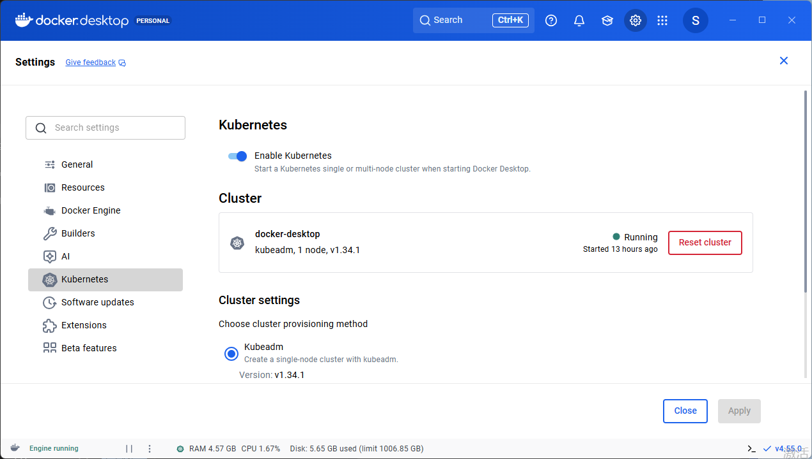
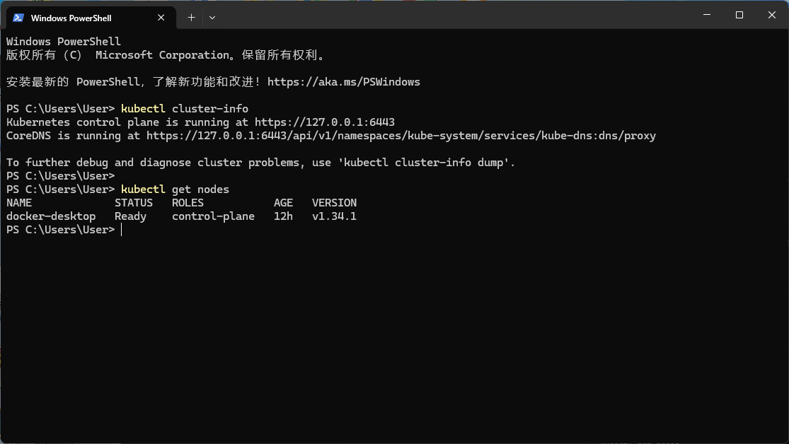
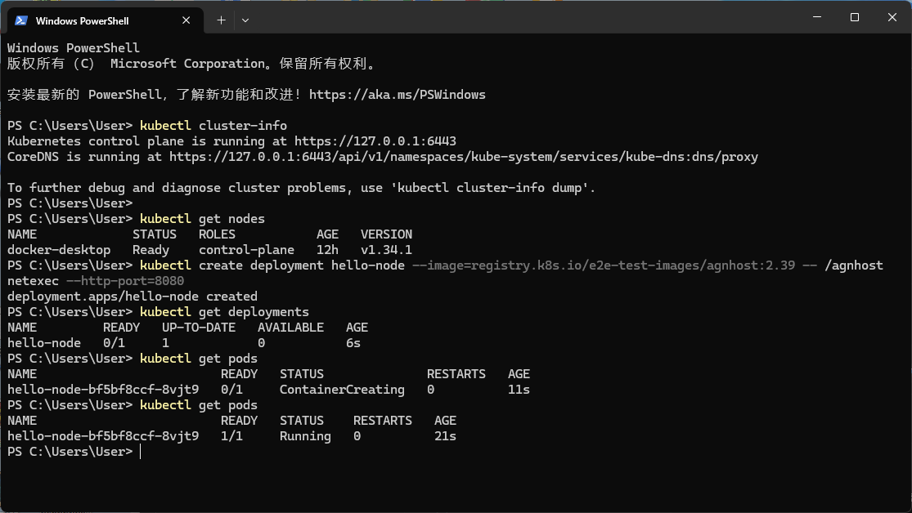
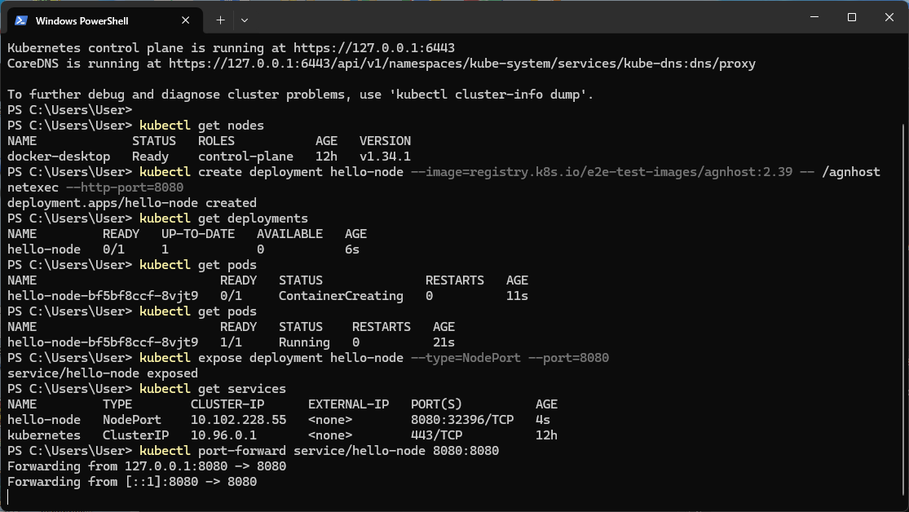
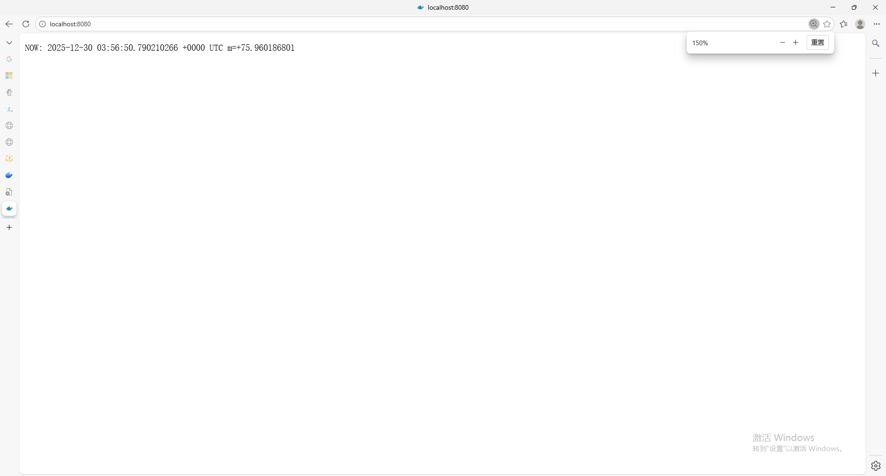
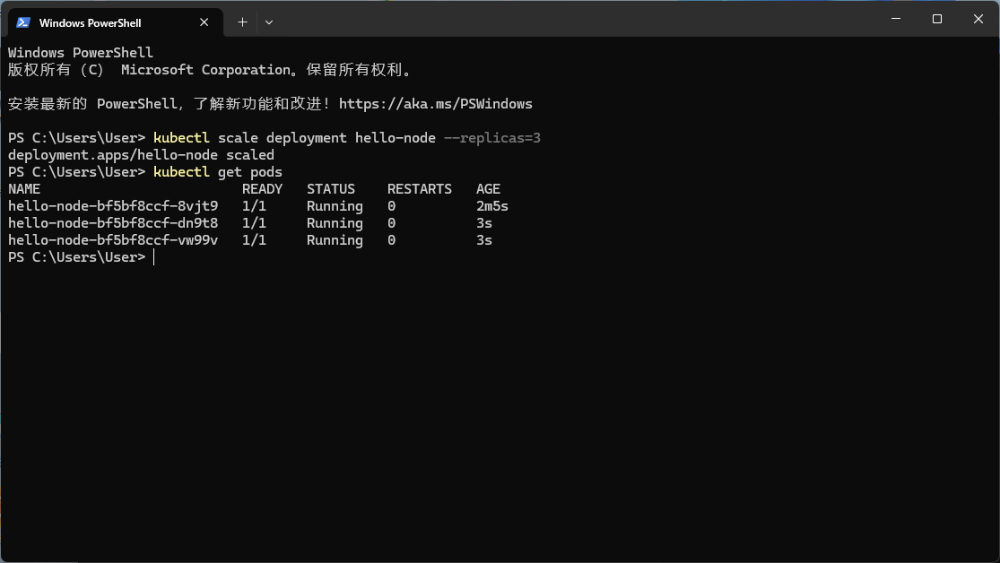
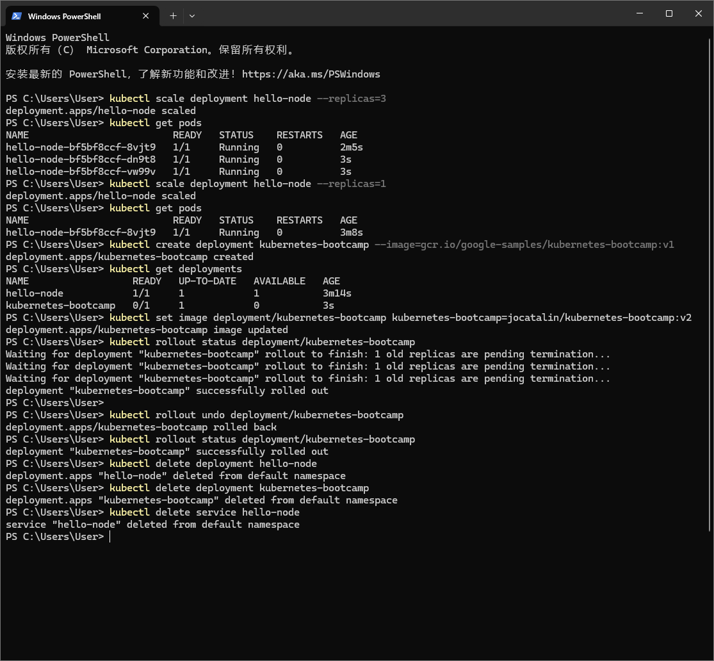

# Lab 6 Report: Kubernetes Fundamentals with Docker Desktop Integration

## 1. Objectives

This laboratory session focuses on core Kubernetes principles and operations, including:
- Configuring a local Kubernetes development environment
- Deploying containerized applications via `kubectl`
- Monitoring and analyzing application states
- Exposing services for external access
- Implementing horizontal scaling
- Managing application updates and reversions

## 2. System Environment

| Component | Specification |
|-----------|---------------|
| Operating System | Windows 11 Professional |
| Docker Desktop Version | 4.55.0 |
| Kubernetes Version | v1.34.1 |
| kubectl Version | v1.34.3 |

**Implementation Note**: This exercise utilized Docker Desktop's integrated Kubernetes functionality rather than Minikube, providing equivalent capabilities with simplified Windows configuration.

## 3. Kubernetes Environment Configuration

### 3.1 Activating Kubernetes via Docker Desktop

Activation procedure:
1. Launch Docker Desktop application
2. Navigate to Settings → Kubernetes section
3. Select the "Enable Kubernetes" checkbox
4. Execute "Apply & Restart" operation


The system initiates retrieval of necessary container images and control plane component startup.



Following successful initialization, the cluster displays:
- **Operational Status**: Active (green status indicator)
- **Cluster Identifier**: docker-desktop
- **Kubernetes Release**: v1.34.1
- **Node Count**: 1 operational node

### 3.2 Cluster Verification Process

Utilizing kubectl for cluster status confirmation:

```bash
kubectl cluster-info
kubectl get nodes
```



**Command Outputs:**
- Kubernetes control plane operational at `https://127.0.0.1:6443`
- CoreDNS service active for domain name resolution
- Node `docker-desktop` operational with `control-plane` designation

## 4. Application Deployment Operations

### 4.1 Deployment Creation

Launching a sample web service:

```bash
kubectl create deployment sample-app --image=registry.k8s.io/e2e-test-images/agnhost:2.39 -- /agnhost netexec --http-port=8080
```

### 4.2 Deployment and Pod Monitoring

```bash
kubectl get deployments
kubectl get pods
```



**Operational Results:**
- `sample-app` deployment successfully initialized
- Initial pod status displays as `ContainerCreating`
- Subsequent pod status transitions to **Running** (Ready: 1/1)

## 5. Service Exposure Configuration

### 5.1 Service Creation

Exposing the deployment through NodePort service:

```bash
kubectl expose deployment sample-app --type=NodePort --port=8080
kubectl get services
```

### 5.2 Port Forwarding for Service Access

Utilizing port-forwarding for local service connectivity:

```bash
kubectl port-forward service/sample-app 8080:8080
```



**Service Specifications:**

| Service Name | Service Type | Cluster IP Address | Network Ports |
|--------------|--------------|-------------------|---------------|
| sample-app | NodePort | 10.102.228.55 | 8080:32396/TCP |

### 5.3 Application Accessibility

With active port-forwarding, the service becomes accessible at `http://localhost:8080`:



The application generates current timestamp responses:
```
NOW: 2025-12-30 03:56:50.790210266 +0000 UTC m=+75.960186801
```

## 6. Application Scaling Implementation

### 6.1 Horizontal Scale Expansion

Increasing replica count to three instances:

```bash
kubectl scale deployment sample-app --replicas=3
kubectl get pods
```



**Scale Results:** Three operational pods:
| Pod Identifier | Operational Status | Active Duration |
|----------------|-------------------|-----------------|
| sample-app-bf5bf8ccf-8vjt9 | Running | 2m5s |
| sample-app-bf5bf8ccf-dn9t8 | Running | 3s |
| sample-app-bf5bf8ccf-vw99v | Running | 3s |

### 6.2 Scale Reduction

Decreasing replica count to single instance:

```bash
kubectl scale deployment sample-app --replicas=1
kubectl get pods
```

## 7. Update Management and Rollback Procedures

### 7.1 Additional Application Deployment

```bash
kubectl create deployment k8s-demo --image=gcr.io/google-samples/kubernetes-bootcamp:v1
kubectl get deployments
```

### 7.2 Rolling Update Execution

Updating container image to newer version:

```bash
kubectl set image deployment/k8s-demo k8s-demo=jocatalin/kubernetes-bootcamp:v2
kubectl rollout status deployment/k8s-demo
```

### 7.3 Version Rollback Implementation

Executing deployment rollback to previous version:

```bash
kubectl rollout undo deployment/k8s-demo
kubectl rollout status deployment/k8s-demo
```



**Workflow Execution Summary:**
1.  Scaled deployment to three replicas
2.  Reduced replicas to single instance
3.  Initialized k8s-demo deployment
4.  Updated container image to v2 release
5.  Executed rollback operation
6.  Confirmed successful rollback completion

## 8. Resource Cleanup Operations

Removing all generated resources:

```bash
kubectl delete deployment sample-app
kubectl delete deployment k8s-demo
kubectl delete service sample-app
```


**Cleanup Execution Results:**
- `deployment.apps "sample-app" deleted from default namespace`
- `deployment.apps "k8s-demo" deleted from default namespace`
- `service "sample-app" deleted from default namespace`

## 9. Essential Command Reference

| Command | Purpose |
|---------|---------|
| `kubectl cluster-info` | Display Kubernetes cluster information |
| `kubectl get nodes` | Enumerate cluster nodes |
| `kubectl create deployment` | Initialize application deployment |
| `kubectl get deployments` | List active deployments |
| `kubectl get pods` | Display pod status |
| `kubectl expose deployment` | Create service for deployment exposure |
| `kubectl get services` | List configured services |
| `kubectl port-forward` | Establish local port forwarding |
| `kubectl scale deployment` | Adjust deployment replica count |
| `kubectl set image` | Modify container image version |
| `kubectl rollout status` | Monitor rollout progress |
| `kubectl rollout undo` | Revert to previous deployment version |
| `kubectl delete` | Remove Kubernetes resources |

## 10. Learning Outcomes Summary

This practical session accomplished comprehensive coverage of fundamental Kubernetes operations:

1. **Environment Configuration**: Established a functional Kubernetes development environment using Docker Desktop's integrated capabilities.

2. **Application Deployment**: Implemented containerized application deployments via declarative `kubectl` commands.

3. **Service Exposure**: Configured service exposure mechanisms and established external connectivity.

4. **Scalability Operations**: Demonstrated horizontal scaling through replica count adjustments.

5. **Update Management**: Executed rolling updates with zero-downtime deployment strategies.

6. **Recovery Procedures**: Implemented rollback mechanisms for deployment recovery.

These foundational competencies establish essential knowledge for advanced topics including service mesh implementation, serverless architectures, and machine learning serving platforms.