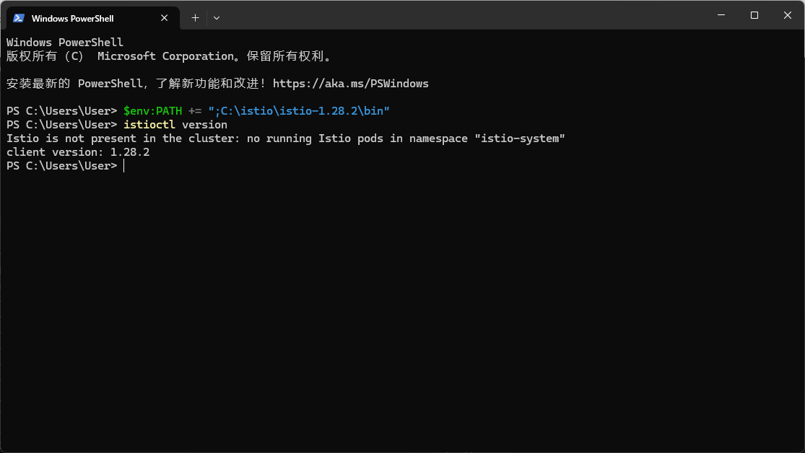
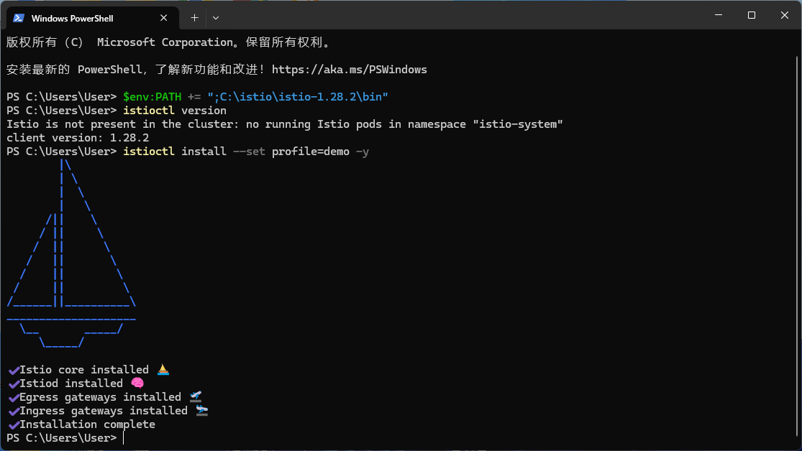
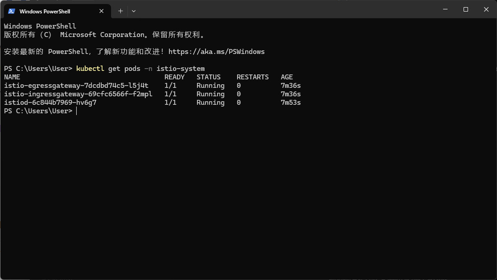
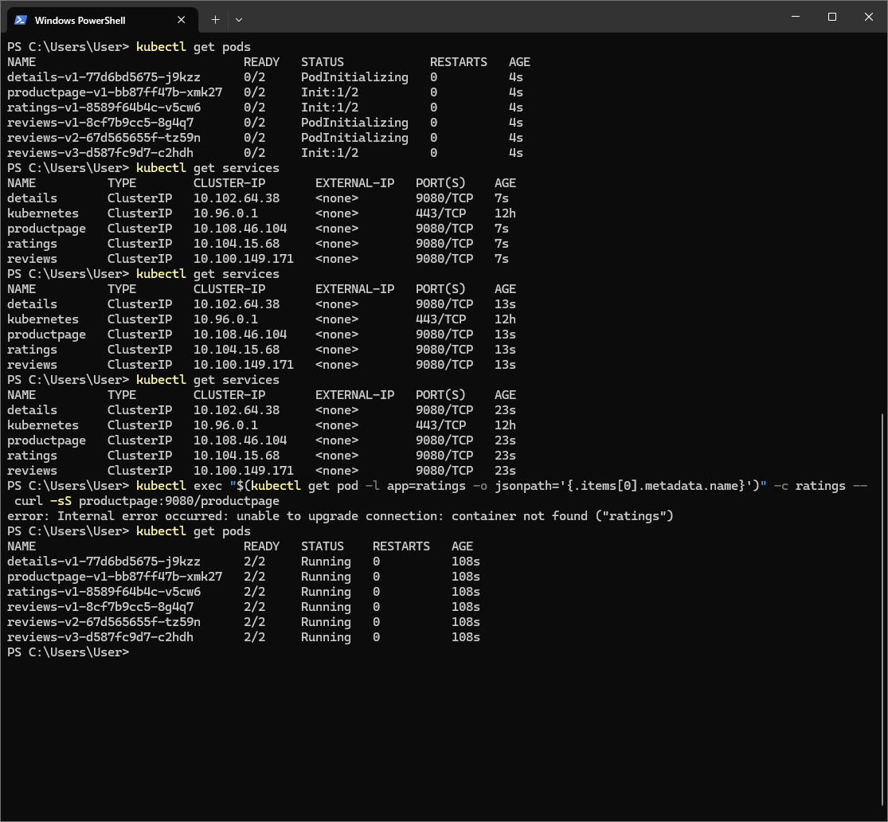
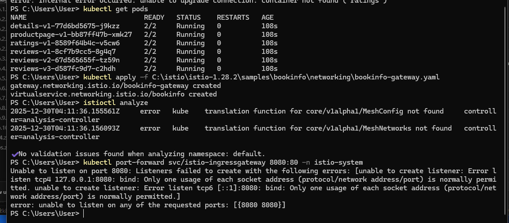

# Lab 7 Report: Introduction to Istio Service Mesh Implementation

## 1. Objectives

This laboratory session focuses on implementing a service mesh through Istio, including:
- Deploying Istio on a Kubernetes cluster
- Installing the Bookinfo demonstration application
- Configuring ingress gateways for external connectivity
- Validating automatic sidecar proxy integration

## 2. System Environment

| Component | Specification |
|-----------|---------------|
| Operating System | Windows 11 Professional |
| Docker Desktop Version | 4.55.0 |
| Kubernetes Release | v1.34.1 |
| Istio Version | 1.28.2 |

## 3. Service Mesh Overview

**Istio** represents an extensible service mesh platform offering:
- **Traffic Control**: Intelligent routing, load distribution, failure recovery
- **Security Enforcement**: Mutual TLS authentication, authorization policies
- **Observability Suite**: Telemetry collection, logging, distributed tracing

Istio functions through **sidecar proxy deployment** (Envoy) adjacent to application containers, mediating all network communication.

## 4. Installation Procedures

### 4.1 Istio Distribution Acquisition

Downloaded Istio 1.28.2 for Windows from official distribution channels:
- Distribution file: `istio-1.28.2-win.zip`
- Extraction location: `C:\istio\istio-1.28.2\`

### 4.2 Environment Configuration and Verification

Added `istioctl` to system path and validated installation:

```powershell
$env:PATH += ";C:\istio\istio-1.28.2\bin"
istioctl version
```



**Output Summary:**
- Client version identifier: 1.28.2
- Cluster status indication: "Istio is not present in the cluster" (pre-installation)

### 4.3 Kubernetes Cluster Installation

Deployed Istio utilizing demonstration configuration profile:

```powershell
istioctl install --set profile=demo -y
```



**Installation Components:**

| Component | Installation Status |
|-----------|-------------------|
| Istio Core |  Successfully deployed |
| Istiod Control Plane |  Successfully deployed |
| Egress Gateway |  Successfully deployed |
| Ingress Gateway | Successfully deployed |
| Overall Status |  Installation finalized |

### 4.4 System Component Verification

```powershell
kubectl get pods -n istio-system
```



**Istio Infrastructure Components:**

| Component | Operational Status | Functional Role |
|-----------|-------------------|-----------------|
| istiod | Running (1/1) | Service mesh control plane |
| istio-ingressgateway | Running (1/1) | External traffic ingress point |
| istio-egressgateway | Running (1/1) | Outbound traffic management |

## 5. Demonstration Application Deployment

### 5.1 Automated Sidecar Integration Activation

Enabled automatic sidecar proxy injection within default namespace:

```powershell
kubectl label namespace default istio-injection=enabled
```

### 5.2 Bookinfo Application Deployment

Deployed sample Bookinfo application from distribution:

```powershell
kubectl apply -f C:\istio\istio-1.28.2\samples\bookinfo\platform\kube\bookinfo.yaml
```

### 5.3 Pod and Service Status Validation

```powershell
kubectl get pods
kubectl get services
```



**Application Service Definitions:**

| Service | Service Type | Network Port | Description |
|---------|--------------|--------------|-------------|
| details | ClusterIP | 9080/TCP | Publication details service |
| productpage | ClusterIP | 9080/TCP | Primary product interface |
| ratings | ClusterIP | 9080/TCP | Rating management service |
| reviews | ClusterIP | 9080/TCP | Review management service |

**Pod Status with Sidecar Integration:**

| Pod Identifier | Readiness Status | Operational State | Description |
|----------------|------------------|------------------|-------------|
| details-v1-... | **2/2** | Running | Details service with Envoy proxy |
| productpage-v1-... | **2/2** | Running | Product page with Envoy proxy |
| ratings-v1-... | **2/2** | Running | Rating service with Envoy proxy |
| reviews-v1-... | **2/2** | Running | Reviews v1 with Envoy proxy |
| reviews-v2-... | **2/2** | Running | Reviews v2 with Envoy proxy |
| reviews-v3-... | **2/2** | Running | Reviews v3 with Envoy proxy |

The **2/2** readiness status confirms dual-container deployment per pod:
1. Primary application container
2. Istio Envoy sidecar proxy container

## 6. External Access Configuration

### 6.1 Gateway Resource Deployment

Configured Istio Gateway and VirtualService for external accessibility:

```powershell
kubectl apply -f C:\istio\istio-1.28.2\samples\bookinfo\networking\bookinfo-gateway.yaml
```



**Generated Resources:**
- `gateway.networking.istio.io/bookinfo-gateway created`
- `virtualservice.networking.istio.io/bookinfo created`

### 6.2 Configuration Validation

```powershell
istioctl analyze
```

**Validation Result:** No configuration issues identified within default namespace

### 6.3 Application Accessibility Verification

Established port forwarding for application access:

```powershell
kubectl port-forward svc/istio-ingressgateway 8080:80 -n istio-system
```

Access point: `http://localhost:8080/productpage`


**Application Interface Components:**
- **Publication Title**: "The Comedy of Errors" by William Shakespeare
- **Publication Metadata**: ISBN, Publisher, Page count, Format, Language
- **Review Section**: User reviews with rating indicators
- **Istio Reference**: Service mesh information link

Interface accessibility confirms:
1. Istio Gateway routing functions correctly
2. Microservice communication operates through service mesh
3. Sidecar proxy integration functions properly

## 7. Application Architecture Overview

The Bookinfo demonstration implements a four-service microservice architecture:

```
                    ┌─────────────────┐
                    │   productpage   │
                    │    (Python)     │
                    └────────┬────────┘
                             │
         ┌───────────────────┼───────────────────┐
         │                   │                   │
         ▼                   ▼                   ▼
┌─────────────────┐ ┌─────────────────┐ ┌─────────────────┐
│     details     │ │     reviews     │ │     ratings     │
│     (Ruby)      │ │     (Java)      │ │     (Node.js)   │
└─────────────────┘ └─────────────────┘ └─────────────────┘
                             │
                    ┌────────┼────────┐
                    ▼        ▼        ▼
                reviews-v1 reviews-v2 reviews-v3
                (no stars) (black)   (red stars)
```

## 8. Essential Command Reference

| Command | Functional Purpose |
|---------|-------------------|
| `istioctl version` | Verify Istio client/server versions |
| `istioctl install --set profile=demo` | Deploy Istio with demonstration configuration |
| `istioctl analyze` | Validate Istio configuration integrity |
| `kubectl label namespace default istio-injection=enabled` | Activate automatic sidecar injection |
| `kubectl get pods -n istio-system` | Inspect Istio system components |
| `kubectl get pods` | Monitor application pods (2/2 indicates sidecar integration) |

## 9. Implementation Summary

This laboratory session successfully implemented foundational Istio service mesh capabilities:

1. **Service Mesh Deployment**: Deployed Istio 1.28.2 on Docker Desktop Kubernetes utilizing demonstration configuration profile.

2. **Sidecar Integration**: Activated automatic sidecar injection with verification of dual-container pod deployment.

3. **Application Deployment**: Installed Bookinfo demonstration application comprising four heterogeneous microservices.

4. **Gateway Configuration**: Established Istio Gateway and VirtualService resources for external service exposure.

5. **Functional Validation**: Successfully accessed application interface through Istio Ingress Gateway, confirming proper traffic management.

This foundation enables exploration of advanced Istio capabilities including traffic management, resilience patterns, and security implementations.