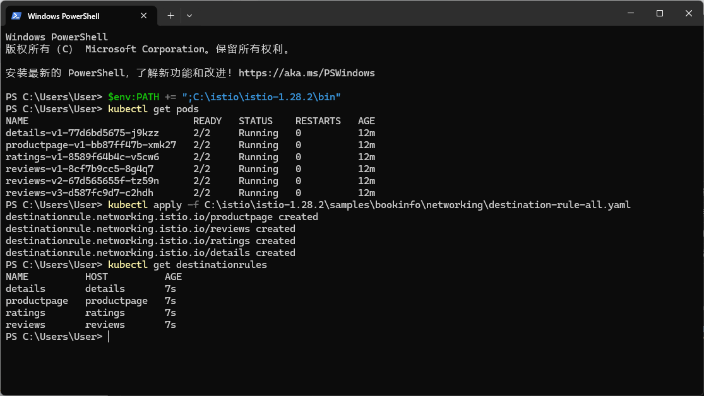
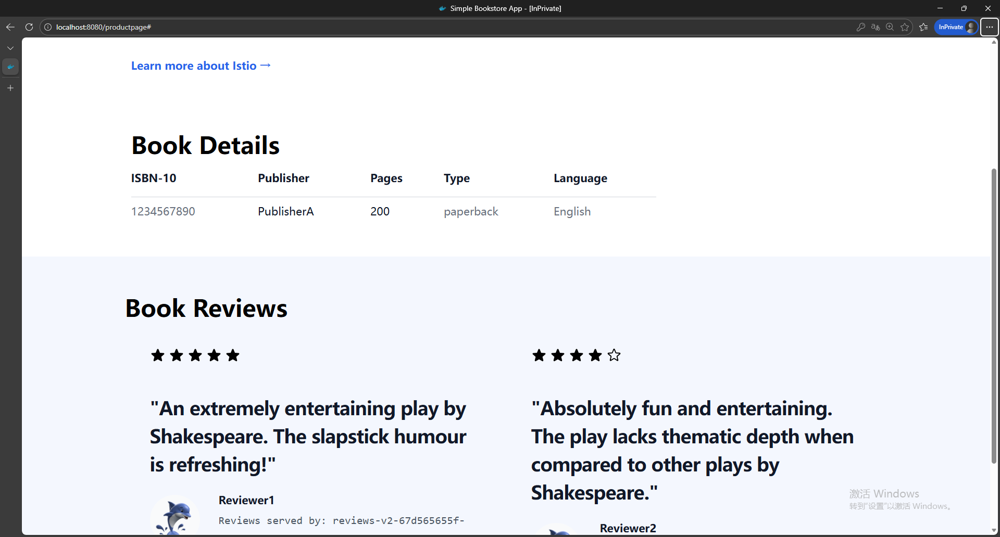
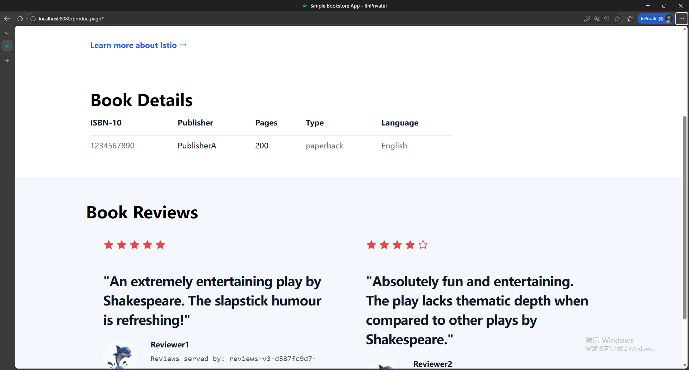
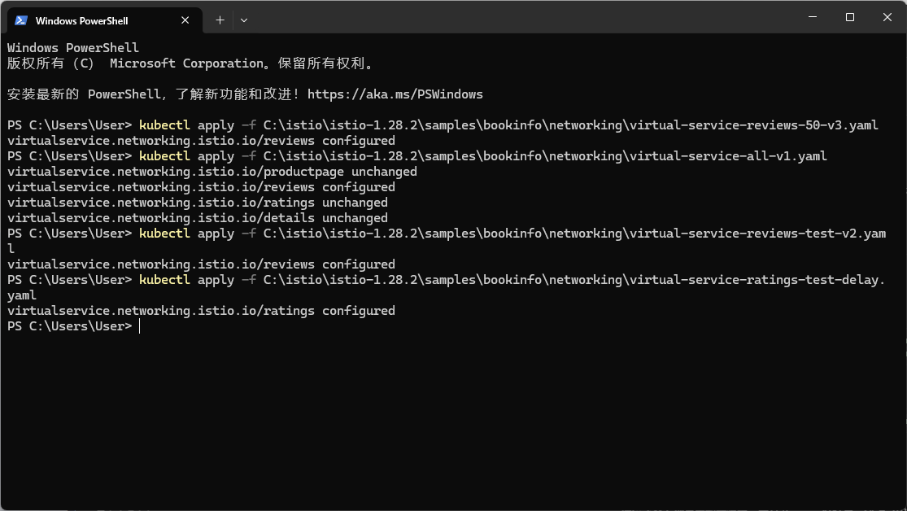
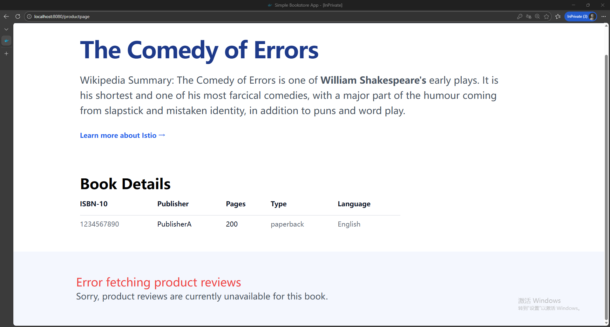
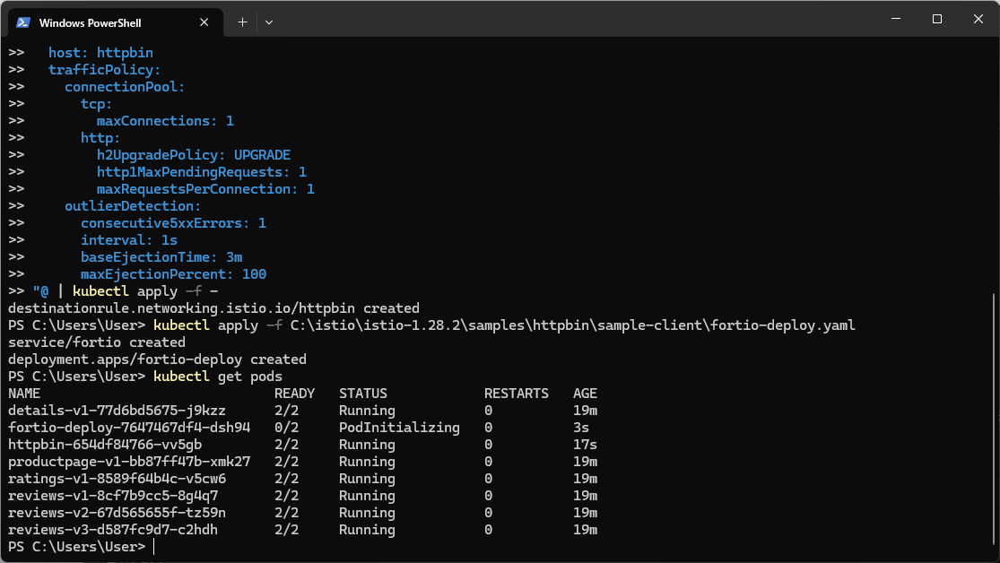
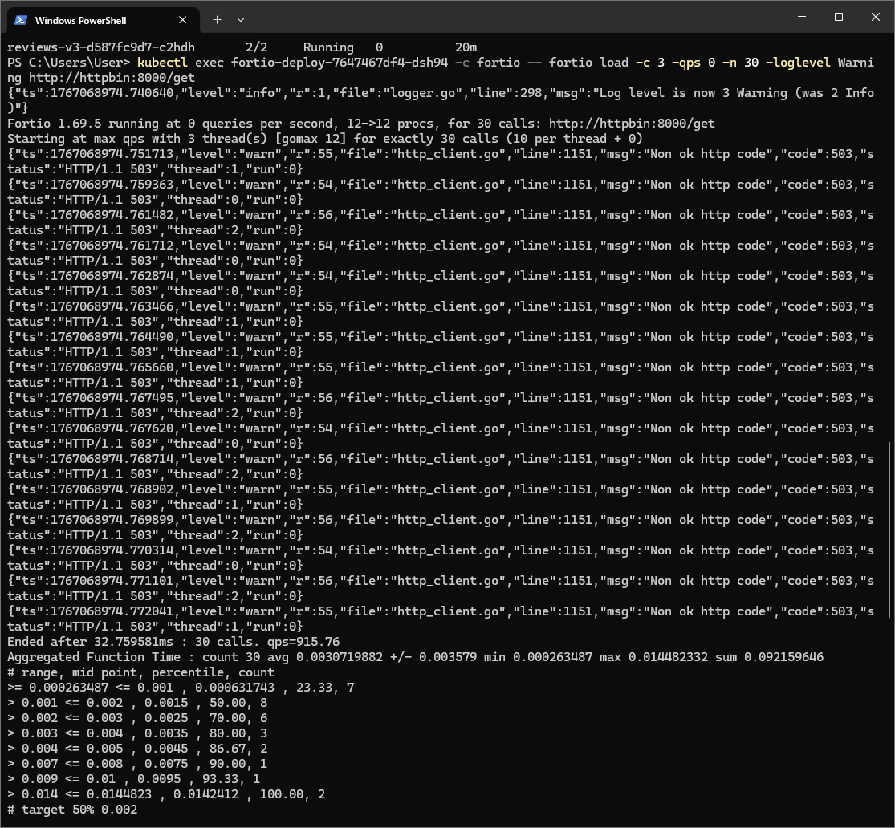
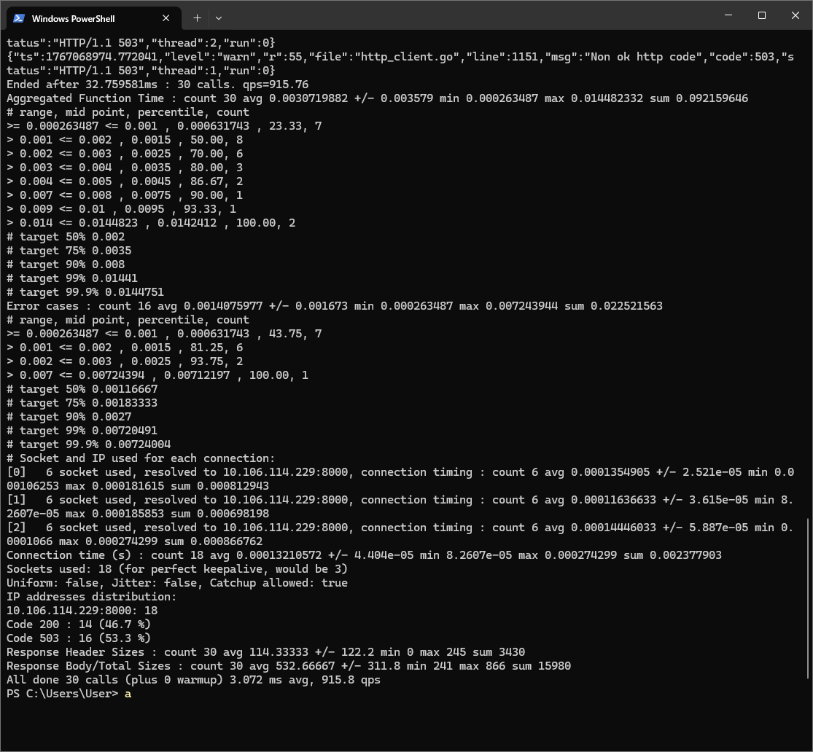

# Lab 8: Advanced Traffic Management with Istio

## Overview

This laboratory session investigates the sophisticated traffic control mechanisms within the Istio service mesh, illustrating practical implementations of traffic redistribution, request direction, fault simulation, and circuit protection for orchestrating service version transitions within microservice ecosystems.

## Technical Environment

- **Operating Platform**: Windows 11 utilizing Docker Desktop
- **Kubernetes Cluster**: Docker Desktop integrated Kubernetes
- **Istio Distribution**: Version 1.28.2
- **Demonstration Application**: Bookinfo microservices

---

## Preliminary Configuration

### Destination Rule Application

Implementation of traffic management policies requires pre-established destination rules delineating service version availability:

```powershell
kubectl apply -f C:\istio\istio-1.28.2\samples\bookinfo\networking\destination-rule-all.yaml
kubectl get destinationrules
```



*Visualization 1: Destination rule definitions for productpage, reviews, ratings, and details service components*

---

## Segment 1: Identity-Based Request Direction

### Objective
Direct network traffic according to user identification attributes, showcasing differential service version experiences across distinct user categories.

### Procedure 1: Uniform Traffic Direction to Version One

```powershell
kubectl apply -f C:\istio\istio-1.28.2\samples\bookinfo\networking\virtual-service-all-v1.yaml
```


*Visualization 2: Bookinfo application interface utilizing reviews v1 (absent star rating indicators)*

### Procedure 2: Targeted User Redirection to Version Two

Configure routing policy directing "jason" user to reviews v2 (dark star indicators) while maintaining v1 access for remaining users:

```powershell
kubectl apply -f C:\istio\istio-1.28.2\samples\bookinfo\networking\virtual-service-reviews-test-v2.yaml
```



*Visualization 3: "jason" user accessing reviews v2 with dark star indicators. Note service indicator: "Reviews served by: reviews-v2-67d565655f-"*

### Analytical Insights
- Anonymous users: Experience reviews v1 interface (without star ratings)
- Authenticated jason user: Experiences reviews v2 interface (with dark star ratings)
- This configuration illustrates practical application of identity-based routing for controlled feature exposure and phased deployment strategies

---

## Segment 2: Progressive Traffic Redistribution

### Objective
Implement gradual traffic transition between service versions through weighted distribution mechanisms.

### Balanced Distribution Methodology

Apply virtual service configuration establishing equal distribution between v1 and v3 service versions:

```powershell
kubectl apply -f C:\istio\istio-1.28.2\samples\bookinfo\networking\virtual-service-reviews-50-v3.yaml
```



*Visualization 4: Reviews v3 interface displaying red star indicators. Note service indicator: "Reviews served by: reviews-v3-d587fc9d7-"*

### Analytical Insights
- Interface refresh cycles demonstrate alternating presentation between v1 (no stars) and v3 (red stars)
- This methodology enables controlled feature introduction through incremental exposure strategies
- Distribution ratios remain configurable (e.g., 90/10, 80/20) supporting risk-managed deployment workflows

---

## Segment 3: System Resilience Testing through Fault Simulation

### Objective
Evaluate application robustness by introducing controlled system disturbances within the service mesh.

### Latency Fault Implementation

Configure 7-second processing delay for ratings service during "jason" user sessions:

```powershell
kubectl apply -f C:\istio\istio-1.28.2\samples\bookinfo\networking\virtual-service-all-v1.yaml
kubectl apply -f C:\istio\istio-1.28.2\samples\bookinfo\networking\virtual-service-reviews-test-v2.yaml
kubectl apply -f C:\istio\istio-1.28.2\samples\bookinfo\networking\virtual-service-ratings-test-delay.yaml
```



*Visualization 5: Application of fault simulation configuration parameters*



*Visualization 6: "Error fetching product reviews" notification - Injected 7-second latency triggers reviews service timeout*

### Analytical Insights
- Reviews service timeout threshold proves insufficient against implemented 7-second delay
- This scenario reveals architectural inconsistency: productpage-to-reviews timeout duration shorter than reviews-to-ratings interval
- Fault simulation methodologies facilitate proactive identification of systemic vulnerabilities prior to production manifestation

---

## Segment 4: Circuit Protection Implementation

### Objective
Establish protective mechanisms preventing service degradation cascades during resource saturation scenarios.

### Phase 1: httpbin Service Deployment

```powershell
kubectl apply -f C:\istio\istio-1.28.2\samples\httpbin\httpbin.yaml
```

### Phase 2: Circuit Protection Configuration

Implement destination rule incorporating protective circuit parameters:

```yaml
apiVersion: networking.istio.io/v1
kind: DestinationRule
metadata:
  name: httpbin
spec:
  host: httpbin
  trafficPolicy:
    connectionPool:
      tcp:
        maxConnections: 1
      http:
        h2UpgradePolicy: UPGRADE
        http1MaxPendingRequests: 1
        maxRequestsPerConnection: 1
    outlierDetection:
      consecutive5xxErrors: 1
      interval: 1s
      baseEjectionTime: 3m
      maxEjectionPercent: 100
```

### Phase 3: Fortio Load Generation Client Deployment

```powershell
kubectl apply -f C:\istio\istio-1.28.2\samples\httpbin\sample-client\fortio-deploy.yaml
```



*Visualization 7: Circuit protection configuration activation with testing container deployment*

### Phase 4: Circuit Protection Mechanism Validation

Execute load validation with triple concurrent connection simulation:

```powershell
kubectl exec fortio-deploy-7647467df4-dsh94 -c fortio -- fortio load -c 3 -qps 0 -n 30 -loglevel Warning http://httpbin:8000/get
```



*Visualization 8: Fortio load testing demonstrating 503 error generation from circuit protection*



*Visualization 9: Testing metrics illustrating circuit protection operational effectiveness*

### Performance Metrics

| Measurement | Quantitative Value |
|-------------|-------------------|
| **Status Code 200** | 14 instances (46.7%) |
| **Status Code 503** | 16 instances (53.3%) |
| **Aggregate Requests** | 30 total |
| **Queries Per Second** | 915.8 QPS |

### Analytical Insights
- Configuration `maxConnections: 1` combined with triple concurrent connections triggers request rejection
- 503 status code generation confirms protective circuit activation during service saturation
- This mechanism effectively inhibits failure propagation chains within microservice architectures
- Anomaly detection subsystems automatically isolate non-responsive service instances

---

## Functional Capabilities Summary

| Capability | Primary Application | Demonstration Outcome |
|------------|---------------------|------------------------|
| **Request Direction** | User-identity based traffic routing | Jason receives v2, remaining users receive v1 |
| **Traffic Redistribution** | Incremental deployment via weighted distribution | Balanced distribution between v1 and v3 |
| **Fault Simulation** | System resilience validation through disturbance injection | Reviews service timeout vulnerability identification |
| **Circuit Protection** | Prevention of failure cascade propagation | 53.3% request rejection under saturation conditions |

## Implementation Conclusions

Istio's traffic management suite delivers sophisticated capabilities for:

1. **Progressive Deployment Strategies**: Controlled feature introduction through traffic redistribution mechanisms
2. **Targeted Feature Exposure**: Specific user group routing for functionality validation
3. **Resilience Validation**: Systematic robustness testing through controlled fault simulation
4. **System Protection**: Service degradation containment through circuit protection implementation

These functional elements prove indispensable for production microservice environment management, facilitating secure deployment methodologies and enhanced systemic reliability.

## Reference Documentation

- [Istio Traffic Redistribution Mechanisms](https://istio.io/latest/docs/tasks/traffic-management/traffic-shifting/)
- [Istio Request Direction Configuration](https://istio.io/latest/docs/tasks/traffic-management/request-routing/)
- [Istio Fault Simulation Methodologies](https://istio.io/latest/docs/tasks/traffic-management/fault-injection/)
- [Istio Circuit Protection Implementation](https://istio.io/latest/docs/tasks/traffic-management/circuit-breaking/)