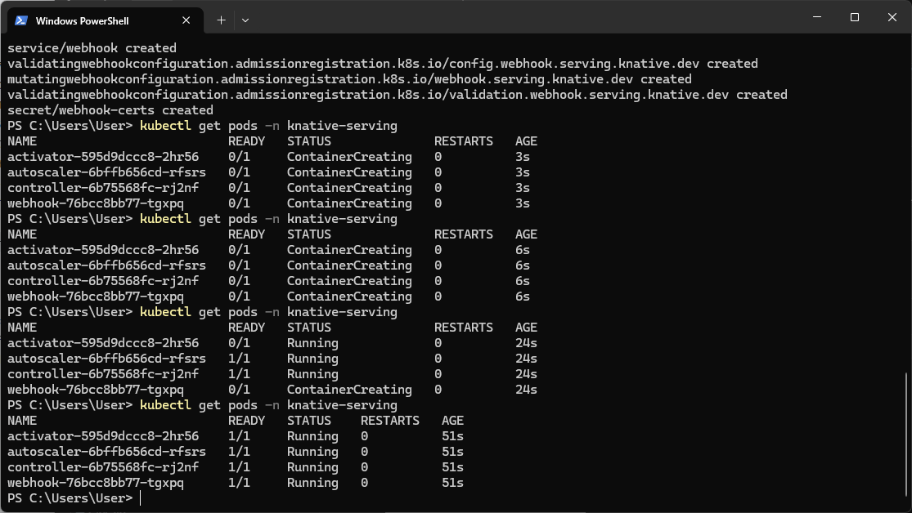
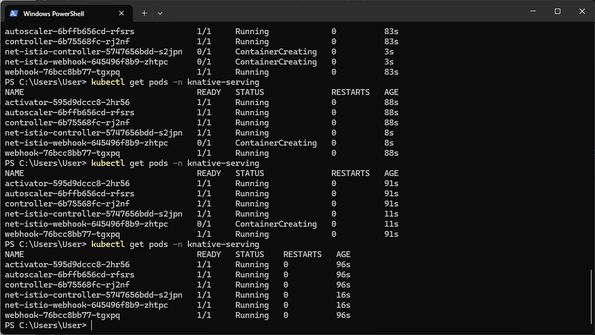
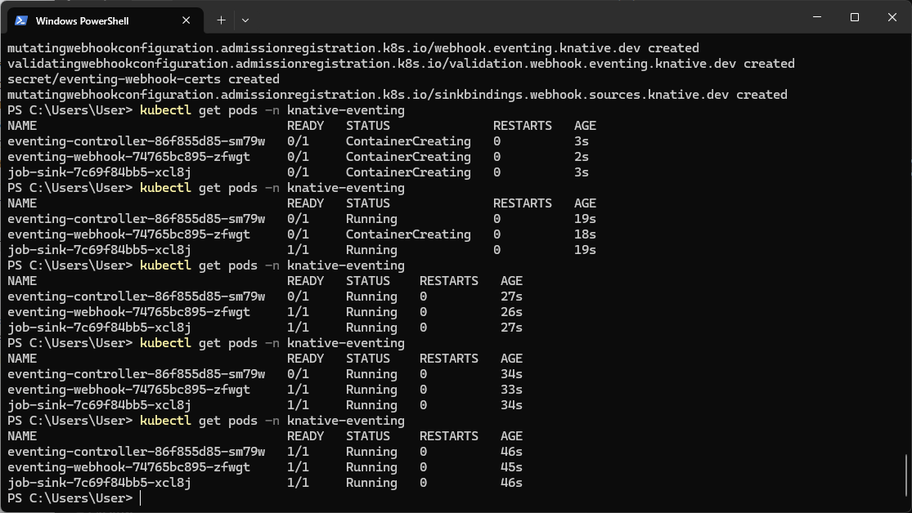
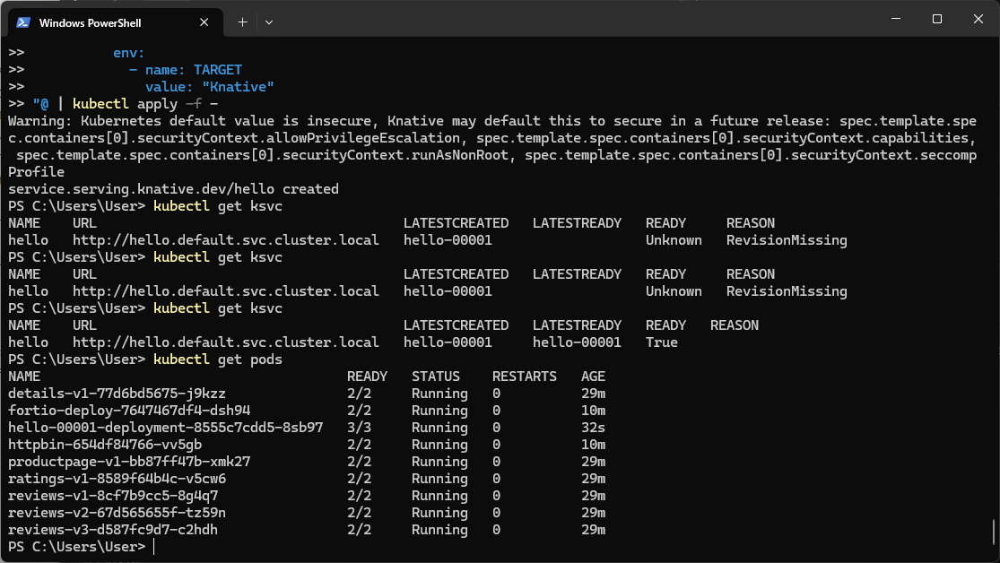
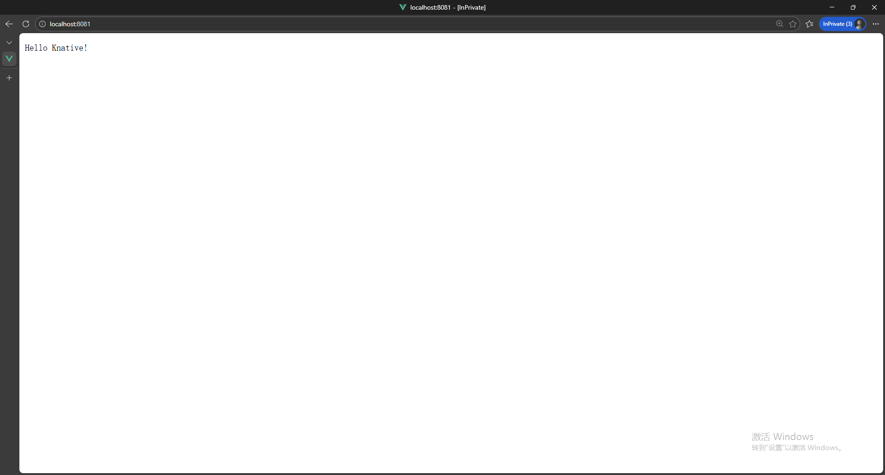
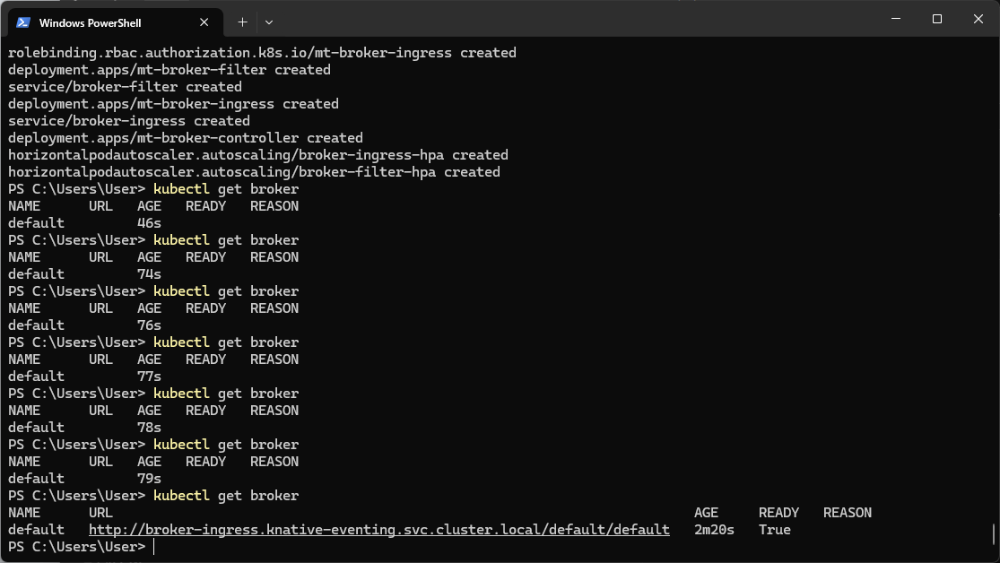
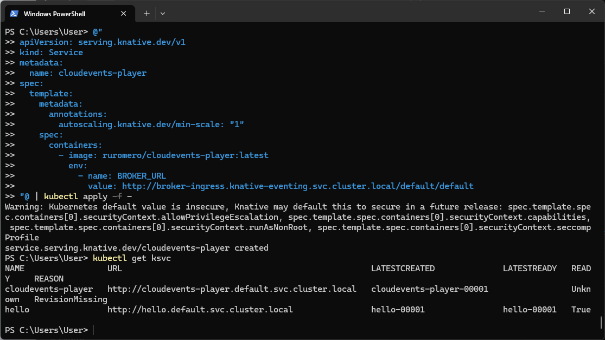
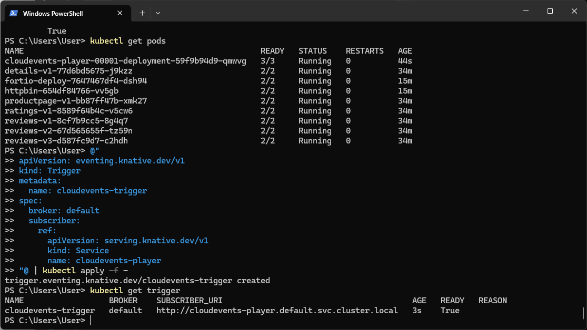

# Laboratory 9: Knative Serverless Framework Implementation

## Overview

This laboratory session provides practical implementation experience with the Knative framework for constructing, deploying, and orchestrating serverless cloud-native applications within Kubernetes environments. Knative comprises two principal components: Serving (for serverless workload deployment and scaling) and Eventing (for event-driven architectural patterns).

## Technical Environment

- **Operating Platform**: Windows 11 utilizing Docker Desktop
- **Kubernetes Platform**: Docker Desktop integrated Kubernetes
- **Knative Distribution**: Version 1.17.0
- **Networking Infrastructure**: Pre-existing Istio installation from previous session

---

## Segment 1: Knative Serving Platform Deployment

### Phase 1: Serving Custom Resource Definitions and Core Components Installation

```powershell
kubectl apply -f https://github.com/knative/serving/releases/download/knative-v1.17.0/serving-crds.yaml
kubectl apply -f https://github.com/knative/serving/releases/download/knative-v1.17.0/serving-core.yaml
```

### Phase 2: Serving Component Verification

```powershell
kubectl get pods -n knative-serving
```



*Visualization 1: Operational Knative Serving components - activator, autoscaler, controller, and webhook all demonstrating Running status (1/1)*

### Core Component Functions
- **activator**: Intercepts and temporarily stores requests destined for inactive service revisions
- **autoscaler**: Dynamically adjusts pod quantities according to incoming request volumes (including zero-scaling capability)
- **controller**: Manages reconciliation processes for Knative resource configurations
- **webhook**: Performs validation and modification functions on Knative resource definitions

---

## Segment 2: Network Layer Integration via Net-Istio

Leveraging the pre-existing Istio installation from prior laboratory work as the networking infrastructure for Knative:

```powershell
kubectl apply -f https://github.com/knative/net-istio/releases/download/knative-v1.17.0/net-istio.yaml
kubectl get pods -n knative-serving
```



*Visualization 2: Net-Istio controller and webhook additions to Knative Serving namespace, all components reporting Running status (1/1)*

---

## Segment 3: Knative Eventing Platform Deployment

### Phase 1: Eventing Custom Resource Definitions and Core Components Installation

```powershell
kubectl apply -f https://github.com/knative/eventing/releases/download/knative-v1.17.0/eventing-crds.yaml
kubectl apply -f https://github.com/knative/eventing/releases/download/knative-v1.17.0/eventing-core.yaml
```

### Phase 2: Eventing Component Verification

```powershell
kubectl get pods -n knative-eventing
```



*Visualization 3: Operational Knative Eventing components - eventing-controller, eventing-webhook, and job-sink all demonstrating Running status (1/1)*

### Core Component Functions
- **eventing-controller**: Administers eventing resources including Brokers, Triggers, and Channels
- **eventing-webhook**: Performs validation procedures on eventing resource configurations
- **job-sink**: Manages event processing through job-based execution models

---

## Segment 4: Initial Knative Service Deployment

### Phase 1: Introductory Application Service Creation

```powershell
@"
apiVersion: serving.knative.dev/v1
kind: Service
metadata:
  name: introductory-service
spec:
  template:
    spec:
      containers:
        - image: gcr.io/knative-samples/helloworld-go
          ports:
            - containerPort: 8080
          env:
            - name: TARGET
              value: "Knative Platform"
"@ | kubectl apply -f -
```

### Phase 2: Service Deployment Verification

```powershell
kubectl get ksvc
kubectl get pods
```



*Visualization 4: Knative Service "introductory-service" deployed with READY status affirmation, alongside introductory-service-00001-deployment pod operational (3/3)*

### Phase 3: Service Functionality Validation

```powershell
kubectl port-forward deployment/introductory-service-00001-deployment 8081:8080
```

Accessing http://localhost:8081 through web interface:



*Visualization 5: "Hello Knative Platform!" response confirmation from serverless service deployment*

---

## Segment 5: Eventing Infrastructure Configuration

### Phase 1: In-Memory Channel and MT Channel Broker Implementation

```powershell
kubectl apply -f https://github.com/knative/eventing/releases/download/knative-v1.17.0/in-memory-channel.yaml
kubectl apply -f https://github.com/knative/eventing/releases/download/knative-v1.17.0/mt-channel-broker.yaml
```

### Phase 2: Event Broker Instantiation

```powershell
@"
apiVersion: eventing.knative.dev/v1
kind: Broker
metadata:
  name: primary-broker
  namespace: default
"@ | kubectl apply -f -
```

### Phase 3: Broker Status Confirmation

```powershell
kubectl get broker
```



*Visualization 6: Broker "primary-broker" confirms READY status with designated URL for event ingress operations*

---

## Segment 6: CloudEvents Visualization Interface Deployment

### Phase 1: Event Source/Sink Service Implementation

```powershell
@"
apiVersion: serving.knative.dev/v1
kind: Service
metadata:
  name: events-visualization
spec:
  template:
    metadata:
      annotations:
        autoscaling.knative.dev/min-scale: "1"
    spec:
      containers:
        - image: ruromero/cloudevents-player:latest
          env:
            - name: BROKER_URL
              value: http://broker-ingress.knative-eventing.svc.cluster.local/default/primary-broker
"@ | kubectl apply -f -
```

### Phase 2: Events Visualization Deployment Verification

```powershell
kubectl get ksvc
```



*Visualization 7: Both "introductory-service" and "events-visualization" services deployed with READY status affirmation*

---

## Segment 7: Event Subscription Trigger Configuration

### Phase 1: Event Subscription Trigger Creation

```powershell
@"
apiVersion: eventing.knative.dev/v1
kind: Trigger
metadata:
  name: events-subscription-trigger
spec:
  broker: primary-broker
  subscriber:
    ref:
      apiVersion: serving.knative.dev/v1
      kind: Service
      name: events-visualization
"@ | kubectl apply -f -
```

### Phase 2: Trigger Status Verification

```powershell
kubectl get trigger
```



*Visualization 8: Trigger "events-subscription-trigger" confirms READY status, establishing event subscription from "primary-broker" to "events-visualization" service*

---

## Implementation Summary

| Component | Deployment Status | Functional Description |
|-----------|------------------|------------------------|
| **Knative Serving** |  Successfully deployed | Core serverless platform for application deployment and dynamic scaling |
| **Net-Istio Integration** |  Successfully configured | Networking layer integration with existing Istio infrastructure |
| **Knative Eventing** |  Successfully deployed | Event-driven architectural support implementation |
| **Introductory Service** |  Successfully deployed | Demonstration serverless function generating platform greeting |
| **Event Broker** |  Operational | Event routing hub established within default namespace |
| **Events Visualization** |  Successfully deployed | Event source/sink interface for event flow testing |
| **Subscription Trigger** |  Operational | Event subscription mechanism connecting broker to service |

## Demonstrated Core Principles

### Knative Serving Capabilities
- **Serverless Application Deployment**: Applications automatically scale according to demand patterns
- **Resource-Efficient Scaling**: Pod resources are released during inactivity periods, optimizing resource utilization
- **Revision Management**: Each deployment iteration generates discrete revisions facilitating controlled rollback procedures
- **Adaptive Scaling**: Integrated autoscaler modulates pod quantities according to traffic patterns

### Knative Eventing Architecture
- **Broker Implementation**: Centralized hub for event reception and distribution mechanisms
- **Trigger Configuration**: Subscription framework for directing events to appropriate services
- **CloudEvents Standardization**: Uniform event data format ensuring cross-service compatibility
- **Decoupled Architecture**: Event producers and consumers operate independently through loose coupling

## Implementation Conclusions

This laboratory session demonstrated comprehensive Knative framework implementation within Kubernetes environments, encompassing:

1. **Knative Serving Platform**: Serverless workload deployment infrastructure with adaptive scaling capabilities
2. **Knative Eventing Framework**: Event-driven architectural patterns utilizing brokers and triggers
3. **Istio Infrastructure Integration**: Advanced networking functionality through established service mesh
4. **Practical Service Deployment**: Operational serverless services and event-driven component implementations

The Knative framework establishes a robust foundation for constructing contemporary cloud-native applications capable of dynamic scaling and real-time event responsiveness.

## Reference Documentation

- [Knative Serving Installation Procedures](https://knative.dev/docs/install/yaml-install/serving/install-serving-with-yaml/)
- [Knative Eventing Installation Procedures](https://knative.dev/docs/install/yaml-install/eventing/install-eventing-with-yaml/)
- [Knative Initial Service Implementation](https://knative.dev/docs/getting-started/first-service/)
- [Knative Eventing Initial Configuration](https://knative.dev/docs/getting-started/getting-started-eventing/)